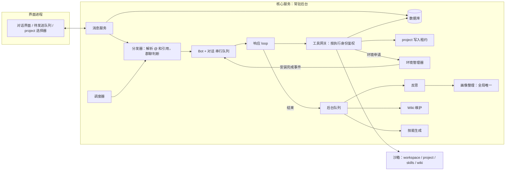

# 06 隔离

隔离分四个层面：执行、数据访问、并发、信任。存储的具体实现见 [11-storage.md](11-storage.md)。

## 执行隔离

仅靠路径隔离不等于安全隔离：Bot 能执行代码，必须在沙箱中运行。本应用是本地客户端，为每个对话常驻一个容器过重，因此采用**分级沙箱**：

| 级别 | 机制 | 安装 | 用途 |
|---|---|---|---|
| 默认 | 各平台系统自带的进程级沙箱 | 无需额外安装 | 绝大多数执行 |
| 增强 | 轻量虚拟机或容器 | 按需安装，需用户确认 | 不可信的导入技能、需要完整 Linux 环境的任务 |

各平台的默认级别：

| 平台 | 默认使用 |
|---|---|
| macOS | 默认级（系统进程级沙箱） |
| Linux | 默认级（系统进程级沙箱） |
| Windows | 增强级（Windows 的进程级隔离较弱且复杂，直接采用增强沙箱） |

- 每次执行在沙箱中运行；workspace 本身就是持久状态，安装的依赖保留在 workspace 中，不需要常驻容器。
- **降级规则**：当前机器上沙箱不可用时，代码执行降级为**逐条确认模式**：每条命令都需用户确认后才在沙箱外执行，界面持续提示原因。绝不悄悄在无沙箱的情况下运行。见 [13-permissions.md](13-permissions.md#沙箱不可用时逐条确认模式)。
- 声明需要增强级沙箱的技能，在增强沙箱不可用时禁用并说明原因。
- Windows 上 WSL2 启用之前处于逐条确认模式。
- 访问范围之外的文件与目录，按软隔离规则经用户授权后访问，见 [13-permissions.md](13-permissions.md)。
- 具体实现与文件系统、网络规则见 [10-sandbox.md](10-sandbox.md)。

其他约束：

- 记忆、画像、消息、附件**只能通过工具网关访问**。工具网关位于核心服务内部，根据本次执行的身份（`bot_id`、`conversation_id`、`loop_type`）做权限校验，LLM 无法通过传入其他 id 越权。
- **凭据**：存放在加密的敏感数据表中，由核心服务代为使用，永远不进入沙箱环境变量，也不进入 LLM 上下文。
- **配额**：每次执行和每天都有 CPU、内存、时长、磁盘和 token 上限。

## 数据访问矩阵

| 资源 | 本 Bot 响应 loop | 本 Bot 后台 loop | 其他 Bot |
|---|---|---|---|
| 当前对话消息 | 读（通过工具） | 读（反思时） | 同群才能读 |
| 其他对话 | 只能看到自己进行中事项的标题 | 只读执行记录摘要 | 不可访问 |
| 当前 workspace | 读写 | 反思时只读 | 不可访问 |
| 当前对话的 project | 读；持有写入租约时读写 | 不可访问 | 同对话的 Bot 权限相同 |
| 本机其他位置 | 经用户授权后访问（授权只属于本 Bot + 本对话） | 不可访问 | 各自申请 |
| 自己的记忆 | 读，可提交候选 | 读写 | 不可访问 |
| 用户画像 | 读，可提交提案 | 只能提案（画像整理 loop 独占写入） | 读，可提交提案 |
| 自己的 Wiki | 只读，可提交入库请求 | 读写 | 不可访问 |
| 自己的 Skills | 只读、执行 | 读写（草稿） | 不可访问 |
| Profile | 只读 | 只读 | 只能看名片（name、bio、职责） |
| 宿主层环境 | 只能申请，需用户确认 | 只能申请，需用户确认 | 只能申请，需用户确认 |

## 并发隔离：每类数据一个写入者

| 数据 | 写入者 |
|---|---|
| Workspace | “Bot + 对话”串行队列中的响应 loop |
| Project | 持有该目录写入租约的 loop（跨对话，见 [08-project.md](08-project.md#并发写入租约)） |
| Bot 记忆 | 每个 Bot 一个写入队列 |
| 用户画像 | 全局唯一的画像整理 loop |
| Wiki | 本 Bot 的 Wiki 维护 loop（串行） |
| Skills | 本 Bot 的技能生成 loop（串行） |
| 宿主层环境 | 环境管理器（串行） |

- 读取一律读快照，不加锁。
- Wiki 与 Skills 用内嵌 git 库管理版本。

## 信任隔离：防提示注入与记忆污染

- 所有进入上下文的内容都标注来源：用户、Bot、工具输出、网页、文件。
- 只有用户本人的消息可以作为用户画像的证据。
- 网页和文件内容只能进入 Wiki 的 `raw/`，不能直接变成记忆。
- 其他 Bot 的发言对当前 Bot 是不可信输入，不能指示它修改记忆或 Profile。
- 导入的技能需用户确认，并只在沙箱中执行。
- 所有改动可审计、可回滚：记忆有证据链，Wiki 与 Skills 有 git 历史，project 有检查点；用户可在“Bot 大脑”面板中查看、编辑、删除记忆，回滚 Wiki 与 Skills。

## 整体数据流

