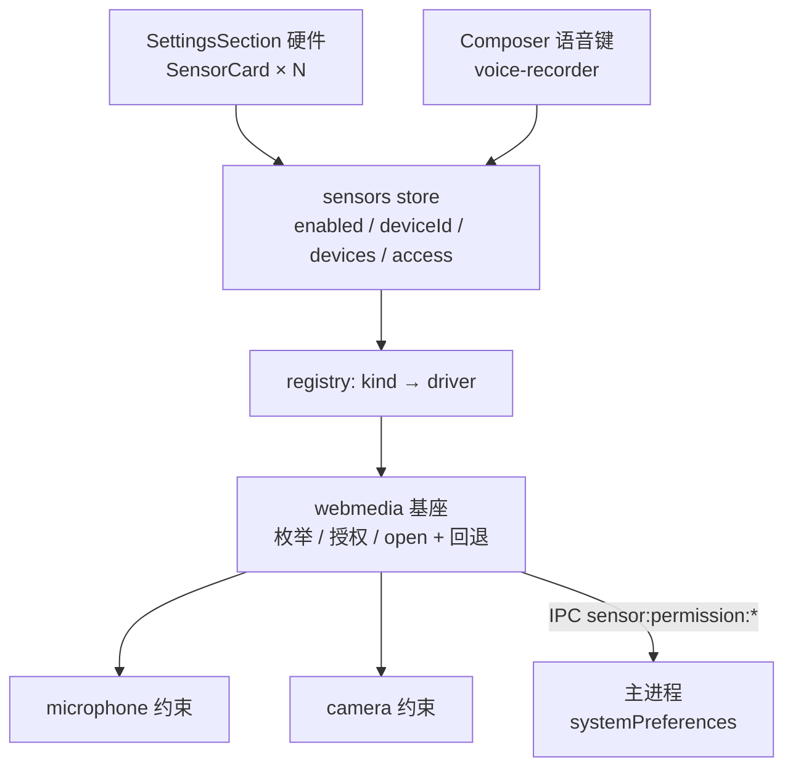

# 31 传感器（Sensors）

KepCup 的硬件接入统一为**传感器**：麦克风、摄像头，以及将来可能的温度、湿度、气压、风力等，都是同一套抽象下的一个条目——有统一的描述、统一的权限与授权流程、统一的设备选择与启停、统一的设置页呈现。界面上的分区仍叫「硬件」，代码与文档里统一叫 `sensor`。决策：D76。

**状态：本期代码已实现（2026-10-08），待三平台实机验收。** 本期范围刻意收窄：**麦克风做实**（把现有语音输入的零散硬件逻辑收编进传感器层并补全），**摄像头只走通硬件**（枚举、授权、设置页预览），Bot 如何使用摄像头（监看）待真实需求确认后另行设计。执行方案与实现备注见 [`todo/sensors.md`](../../todo/sensors.md)。

相关：D69（语音输入，本文收编其硬件部分）、D37（授权有效期，监看阶段沿用）、D44（Bot 浏览器，其 Port B 暴露方式是监看阶段的先例）、D58（对话内设置引导）、D72 能力包注册表（`HOST_CAPABILITIES`，本文描述表沿用同一写法）、D75（对话轮，监看阶段的唤醒方式）。

## 决策

- **D76 传感器统一管理**：
  1. **三个维度分开建模**：`kind`（测什么：microphone / camera / temperature …）、`transport`（怎么接：`webmedia` 渲染层 `getUserMedia`；未来 `serial` / `ble` / `hid` 在主进程，`network`（MQTT / HTTP / HomeAssistant）在 core）、`dataShape`（数据形态：`stream-audio` / `stream-video` / `scalar`）。加一种传感器 = 注册表加一行 + 一个 driver + 设置页一个测试插槽，不改 IPC、preload、设置页骨架。
  2. **注册表是纯数据**：`packages/shared/src/domain/sensors.ts` 的 `SENSOR_KINDS` 描述表（写法同 `HOST_CAPABILITIES`），渲染层与主进程共用同一份事实。
  3. **硬件宿主在渲染层 / 主进程，不在 core**：core 是独立 utilityProcess，碰不到设备。本期没有任何 core 改动；将来 core 取传感器数据一律经 Port B 向主进程要（同 `browser.*`）。
  4. **设备偏好与启停是本机偏好**，本期留在渲染层 localStorage（沿用 26 的结论），单键 `kepcup.sensors.v1`，兼容旧键 `kepcup.micDeviceId`。「启用了哪些传感器」要等监看阶段 core 需据此暴露工具时才升级到 core settings。
  5. **摄像头默认关闭，麦克风默认开启**（后者保持现状行为）。启用开关是隐私总闸：关闭后该传感器的所有消费者（语音键、将来的 Bot 工具）一律拒绝，不做静默放行。
  6. **摄像头本期不做任何 Bot 侧能力**：不抽帧、不做工具、不动 core 与 RPC。预览只在设置页内，由用户主动开启，关闭页面即释放。
  7. **default session 权限收紧**：Electron 在未设置处理器时默认放行所有权限请求。本期为自家窗口的 default session 增加权限请求 / 检查处理器：仅放行 `media`（且请求来源为应用自身窗口），其余拒绝。白名单：`media`（仅 audio / video）、`clipboard-sanitized-write`（复制按钮）、`fullscreen`（`<video controls>` 全屏键），依据静态审计；被拒请求记 `[permissions] denied request` warn，供发现遗漏的合法依赖。实现见 `apps/desktop/src/main/app-permissions.ts`。Bot 浏览器 session 已全拒（`browser-host.ts`），不变。

## 1 注册表

```ts
type SensorTransport = 'webmedia' | 'serial' | 'ble' | 'hid' | 'network';
type SensorDataShape = 'stream-audio' | 'stream-video' | 'scalar';

interface SensorKindDescriptor {
  id: SensorKind;                       // 'microphone' | 'camera' | …
  transport: SensorTransport;
  dataShape: SensorDataShape;
  /** macOS TCC / 系统隐私面板对应的媒体类型；无系统权限门的传感器为 null。 */
  osMediaType: 'microphone' | 'camera' | null;
  defaultEnabled: boolean;              // microphone: true；camera: false
  i18nKey: string;                      // 名称 `{i18nKey}.name`、说明 `{i18nKey}.description`
}
```

本期只登记 `microphone`、`camera` 两项，且 `transport` 只实现 `webmedia`；其余取值是类型层面的预留，不写任何实现。`SensorKind` 由 zod enum 导出，新增传感器时编译器会逼出所有需要补的位置（driver 映射、i18n、设置页测试插槽）。

## 2 分层



### 2.1 主进程与 preload

- `mic:status | mic:request | mic:openSettings` 泛化为 `sensor:permission:status | request | openSettings`，参数为 `kind`；主进程按描述表的 `osMediaType` 映射到 `systemPreferences.getMediaAccessStatus / askForMediaAccess` 与系统设置深链（`Privacy_Microphone` / `Privacy_Camera`）。`osMediaType === null` 或非 macOS 一律返回 `granted`（Windows 用自己的隐私指示器，Linux 无此机制）。入参 `kind` 在主进程用 zod 校验，未知 kind 拒绝。
- preload 的三个 `mic*` 方法替换为三个 `sensor*`；这是应用内部 API，无外部消费者，直接替换不留别名。
- `electron-builder.yml` 增 `NSCameraUsageDescription`；macOS 打包版若启用 hardened runtime，entitlements 需含 `com.apple.security.device.camera`（与已有的麦克风项对照核实）。

### 2.2 渲染层 `lib/sensors/`

```ts
interface SensorDriver {
  readonly kind: SensorKind;
  listDevices(): Promise<SensorDevice[]>;          // { deviceId, label }
  permissionStatus(): Promise<SensorPermissionStatus>; // 只读系统权限，不弹框（设置页常驻显示）
  ensureAccess(): Promise<SensorAccess>;           // 授权门：'granted' | 'denied' | 'unavailable'
  openSettings(): void;                            // 深链系统设置（denied 后的去路）
  open(deviceId: string): Promise<OpenedSensor>;   // webmedia: { stream, requestedDeviceId, fellBack }
}
```

- `webmedia.ts`：麦克风与摄像头共用的部分——按 `audioinput` / `videoinput` 枚举、经 IPC 的授权门（语义同 26 的 TCC 表，不变）、`open` 依次尝试「软约束 + 指定设备 → 仅指定设备 → 系统默认」（`OverconstrainedError`，或指定设备时的 `NotFoundError`，才继续降级；授权被拒等直接上抛；逻辑从 `voice-recorder` 的 `openMicStream` 搬来并多一步：只是软约束不满足时仍保留所选设备）。**只有落到系统默认这一步才报告回退**（`fellBack: true`），消费者与设置页据此提示「所选设备不可用，已使用系统默认」，不再静默。
- `microphone.ts` / `camera.ts`：只写各自的软性约束（麦克风沿用 26 的 `CAPTURE_CONSTRAINTS`；摄像头 `width/height: { ideal }`、`facingMode` 不设）。
- `registry.ts`：`kind → driver` 映射；`getDriver(kind)` 对未实现的 transport 抛错，不静默。
- `hub.ts`（`SensorHub`，纯 TS 可单测）+ `sensors.svelte.ts`（$state 镜像）：每个 kind 一份 `{ enabled, deviceId, devices, access, lastError }`；监听 `navigator.mediaDevices` 的 `devicechange` 自动刷新设备（现状只能手动刷新）；偏好读写集中在这里，localStorage 不可用时静默降级（只影响跨会话记忆）。
- 旧偏好迁移：首次读取 `kepcup.sensors.v1` 不存在时，从 `kepcup.micDeviceId` 导入麦克风 `deviceId`，写回新键后保留旧键不删（回滚安全）。
- `voice-recorder.ts`：`startVoiceRecording(stream, onLevel)` 接收已由 `sensors.open('microphone')` 打开的流，其余（AudioWorklet、WAV 编码、电平）不变——这是语音输入功能，不是传感器层职责。

### 2.3 设置页「硬件」

`HardwareSection` 改为遍历注册表渲染 `SensorCard`，每张卡：

| 区块 | 内容 |
|---|---|
| 头部 | 名称 + 启用开关 |
| 设备 | 下拉（系统默认 + 枚举结果，未授权时的无名设备提示同现状）+ 刷新键 |
| 权限 | 状态徽标（已授权 / 未授权 / 已拒绝）+ 按钮：`not-determined` →「授权」，`denied` →「打开系统设置」 |
| 测试区 | 按 kind 的插槽：麦克风 = 电平条（开始 / 停止测试）；摄像头 = 实时预览 `<video>` |

- 测试区只在用户点击「测试」时才打开设备，离开分区 / 关闭弹框 / 卸载时 `track.stop()` 释放（`$effect` cleanup），不在后台持有设备。
- 启用开关为关时，设备下拉与测试区禁用，权限区仍可见（用户可以先授权再启用）。
- 摄像头预览使用 `srcObject = MediaStream`，不经 URL，现有渲染层 CSP（`media-src 'self' blob:`）无需放宽。

## 3 本期功能边界

| | 麦克风 | 摄像头 |
|---|---|---|
| 枚举 / 热插拔 | ✓ | ✓ |
| 权限状态常驻显示、一键授权 / 去系统设置 | ✓ | ✓ |
| 设备选择与持久化 | ✓ | ✓ |
| 启用开关 | ✓（默认开） | ✓（默认关） |
| 设备丢失显式提示 | ✓ | ✓ |
| 测试 | 电平条 | 实时预览 |
| 实际功能消费者 | 语音输入（经 store 取流） | **无** |
| Bot 工具 / core 改动 | — | **无** |

## 4 为监看预留的缝（本期不实现）

以下只作为边界声明，防止本期的抽象与之冲突；真正设计在监看需求确认后另立一篇。

- **采集宿主不能依赖主窗口。** 窗口关闭只是 `hide()`（托盘常驻），隐藏窗口的渲染层定时器会被节流。长期监看需要主进程托管一个隐藏的 sensor-host 窗口（范式同 Bot 浏览器页的 `WebContentsView` 托管），sensor store 的 `open()` 在那里同样可用——所以本期 driver 不假设 UI 存在。
- **core 经 Port B 取数据。** 增 `sensor.*` 平台方法，注册方式同 `BROWSER_RPC_METHODS`；core 侧工具在 `HOST_CAPABILITIES` 登记 `sensors` 能力包，访问按 Bot + 对话授权（D37），图像理解走现有 `understand_image`。
- **监看的触发**：定时 / 事件唤醒 Bot 的对话轮（D75），不是常驻 loop。
- **隐私**：摄像头 / 麦克风被 Bot 使用时必须有用户可见的采集指示；启用开关（D76-5）是硬闸。
- **标量传感器**：driver 在主进程或 core，读数进 core 时序表，阈值事件走同一唤醒链路；`dataShape: 'scalar'` 此时才引入读数类型与存储，本期不预建。

## 5 测试锚点

- shared：描述表快照与 zod 校验（每个 kind 的 `transport` / `osMediaType` 组合合法）。
- 渲染层单测（伪造 `navigator.mediaDevices`）：枚举过滤 kind、`exact` → Overconstrained → 回退并报告 `fellBack`、`devicechange` 刷新、偏好迁移（旧键 → 新键，旧键保留）、localStorage 抛错降级、启用关闭时 `open` 拒绝。
- 主进程：`sensor:permission:*` 的 kind 校验与 TCC 映射（`systemPreferences` 注入伪实现）；非 macOS 恒 granted。
- e2e：Playwright 以 Chromium 伪设备参数启动（`--use-fake-device-for-media-stream --use-fake-ui-for-media-stream`），覆盖设置页启用麦克风 → 测试电平条出现、启用摄像头 → 预览 `<video>` 出现 `videoWidth > 0`、关闭分区后轨道已 stop。这同时补上 26 号文档里一直暂缓的语音键 e2e。
- 实机：三平台摄像头预览、macOS 打包版授权弹框（见 todo P4）。

## 6 非目标

- 摄像头的任何 Bot 侧能力（抽帧、录像、移动检测、监看任务）。
- 标量传感器（温度 / 湿度 / 气压 / 风力）的任何实现，包括读数类型与存储。
- sensor-host 隐藏窗口与 `sensor.*` Port B 方法。
- 偏好升级到 core settings；多设备同时启用同类传感器（本期每个 kind 只选一个设备）。
- 麦克风以外的音频功能变更（流式转写、语音对话模式仍按 26 号暂缓）。
