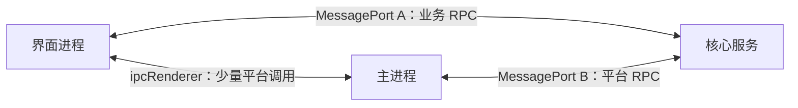
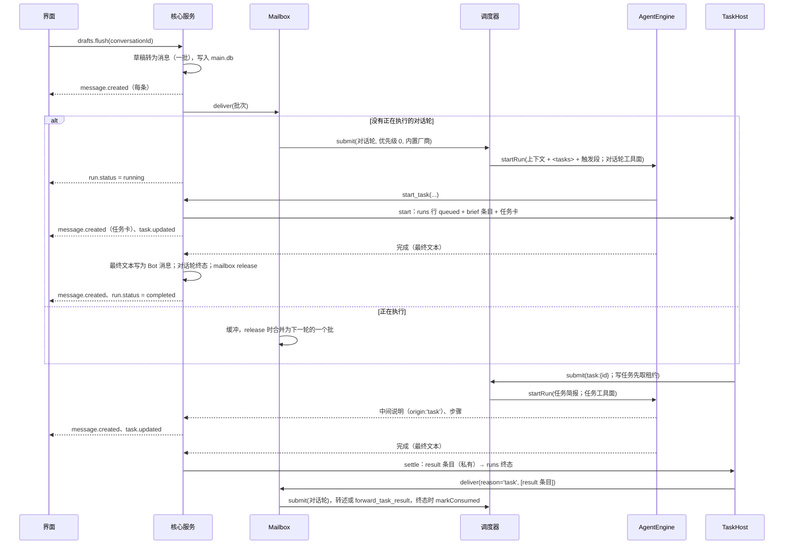
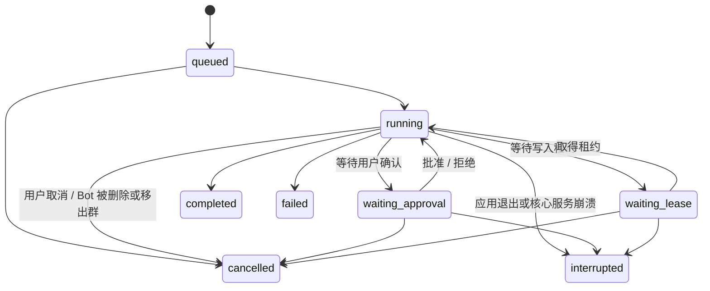

# 02 架构落地

设计依据：[design/06-isolation-and-storage.md](../design/06-isolation-and-storage.md)、[design/07-local-runtime.md](../design/07-local-runtime.md)、[design/09-tech-stack.md](../design/09-tech-stack.md)。

## 进程

| 进程 | 创建方式 | 职责 |
|---|---|---|
| 主进程 | Electron 启动 | 托盘、窗口、看护核心服务、系统对话框（选择目录）、系统通知、电源事件、浏览器页面托管、用系统浏览器打开授权页（`shell.openExternal`，D73）、`kepcup-app://` 特权协议处理器与子框架导航拦截（MCP Apps，D73 P3） |
| 界面进程 | 主进程创建的 `BrowserWindow` | Svelte 界面 |
| 核心服务 | 主进程通过 `utilityProcess.fork()` 启动（使用 Electron 内置的 Node） | 全部业务逻辑与数据 |
| 沙箱子进程 | 核心服务按命令启动 | 执行 Bot 的命令 |
| Bot 浏览器页面 | 主进程创建的 `WebContentsView`（每个 Bot 独立会话） | 浏览器工具（P11） |

- 选择 `utilityProcess` 的理由：它是 Electron 官方的 Node 子进程方案，支持 `MessagePort`，随应用退出而退出；原生模块按 Electron ABI 编译即可加载（**需验证**，P00）。
- 窗口关闭时主进程与核心服务都保持运行（托盘）；从托盘退出时三者一起退出。

## 进程间通信



- **端口 A（界面 ↔ 核心服务）**：主进程创建 `MessageChannelMain`，一端交给核心服务，另一端经 preload 交给界面。所有业务调用走这里。
- **端口 B（主进程 ↔ 核心服务）**：核心服务请求平台能力（发送系统通知、控制 Bot 浏览器、更新托盘状态、用系统浏览器打开授权页 `shell.openExternal`），主进程转发平台事件（电源恢复、窗口焦点变化）。
- **ipcRenderer（界面 ↔ 主进程）**：只用于必须由主进程完成的界面动作：打开系统目录选择框、打开 Bot 浏览器窗口、窗口控制。选择目录的结果（路径）由界面再通过端口 A 交给核心服务。
- preload 使用 `contextBridge` 只暴露：获取端口 A、上述少量 ipc 方法。界面进程开启 `contextIsolation`、`sandbox`，关闭 `nodeIntegration`。

### RPC 约定

- 使用 birpc，在两个端口上各建立一个双向 RPC 实例。
- 契约定义在 `packages/shared/src/rpc/`：
  - `methods.ts`：每个方法一个 zod 输入 schema 与输出 schema。
  - `events.ts`：核心服务推送给界面的事件及其载荷 schema。
- 方法命名 `领域.动作`，例如 `conversations.list`、`drafts.add`、`drafts.flush`、`messages.recall`、`runs.cancel`、`approvals.decide`。
- 核心服务在 RPC 层用 zod 校验所有输入；校验失败返回 `INVALID_INPUT`。
- 事件命名 `领域.事件`，例如 `message.created`、`run.status`、`run.progress`、`approval.created`、`approval.resolved`、`lease.waiting`、`grant.changed`、`task.updated`（D75：任务卡 / 状态行的 `TaskView`）、`draft.changed`、`conversation.updated`、`bot.updated`、`unattended.changed`、`core.status`。D75 的任务 RPC：`tasks.get`、`tasks.active`（对话中未结束任务的视图）、`tasks.answer`（问题卡点选）；取消 / 重试任务沿用 `runs.cancel` / `runs.retry`；`runs.list` 加 `active: true` 只列未结束的执行（状态行初始化用）。其他功能的 RPC 举例：`delegation.updated`（D71 委派卡重绘）；`tasks.interrupted`（D78：撤销授权中断了进行中的任务，渲染端提示条数）与 `effects.list`（任务续接链的外部副作用台账，「检查后重试」用）；`mcp.toolRisks`（D65 修订：设置页逐工具风险与审批策略）；连接应用（D73 P0）的 `apps.connect` / `apps.connect.continue` / `apps.connect.cancel` / `apps.setClientCredentials` / `apps.connections.list` / `apps.disconnect` / `mcp.removeServer` 与事件 `apps.connect_flow`、`apps.connection_status`；P1 再加 `apps.catalog.list`、`apps.connect.confirmTools`（首连工具复核）、`apps.connections.update` / `tools` / `setToolPolicy` / `reviewTools` / `grants`、`apps.grants.revoke`、`apps.tools.approveAfterTest`（`mcp.test` 返回 `toolHashes` / `needsAuth`），`apps.connection_status` 增 `tools_changed` 详情（见下文「连接应用」）。P2 再加 `apps.oauthClients.list` / `set` / `remove`（自带 OAuth 客户端，不返回 secret）、`apps.flowLog`（开发者模式的授权事件日志）、`apps.egressSummary`（Bot 详情的污点外发汇总）、`mcp.rawTools` / `mcp.refreshTools`（开发者模式：原始工具定义与手动刷新）、`mcpb.inspect` / `mcpb.install`（本地包安装）；`settings.update` 的 `apps` 入参开放 `developerMode` / `taintGuard`；主进程 IPC `dialog:selectFile`（选择 `.mcpb`）。
- 界面只通过事件更新状态，不轮询。

## 核心服务模块

模块目录见 [01-conventions.md](01-conventions.md#仓库结构)。核心接口如下（TypeScript 示意，实现时可调整细节，但职责边界不变）。

### 执行身份

每次执行、每次工具调用都携带执行身份，工具网关只信任它，不信任模型传入的任何 id。

```ts
type LoopType =
  | 'turn' | 'task'                       // D75：对话轮（只读）/ 任务（task_writes=false 时只读）
  | 'subagent'                            // D66：任务内 delegate_task 的嵌套子 run
  | 'triage' | 'reflection' | 'memory_consolidation'
  | 'profile_curation' | 'wiki_maintenance' | 'skill_authoring' | 'conversation_summary'
  | 'host';                               // 仅 core：宿主伪身份（回退、系统安装、技能导入审批），不落 runs 行，可写

interface RunIdentity {
  runId: string;
  botId: string | null;          // 画像整理等全局 loop 为 null
  conversationId: string | null; // 后台 loop 为 null
  loopType: LoopType;
  chainId?: string;              // Bot 间 @ 连锁
  chainDepth?: number;
}
```

- shared 的 `loopTypeSchema` 没有 `'host'`（它从不出现在 runs 行与 RPC 里）；`'response'` 已改名 `'turn'`、不保留别名（runs 迁移 0007、main 迁移 0020 改写旧行）。
- 写权限由 `ProjectRuntime.writeDenial(identity)` 统一裁决：`turn` 恒只读；`task` 仅 `task_writes === true` 可写（行缺失或为 null 时 fail closed）；`subagent` 沿 `parentRunId` 继承根 run 的规则；被拒的写返回 `RUN_READ_ONLY`。

### AgentEngine（pi 的封装）

业务代码只依赖这个接口，不直接 import pi。实现位于 `core/src/agent/pi-engine.ts`。

```ts
interface AgentEngine {
  startRun(spec: RunSpec): RunHandle;
  complete(req: CompletionRequest): Promise<CompletionResult>; // 单次调用：群聊判断、结构化提取（外部 Agent：一次性精简会话，P6）
}

interface RunSpec {
  identity: RunIdentity;
  model: ModelRef;                       // "provider/modelId"；外部 Agent 为伪 ref "agent:{id}/{model|default}"
  buildSystemPrompt: () => Promise<string>; // 每次请求前调用，可刷新“我的状态”等
  messages: EngineMessage[];             // 上下文消息 + 触发消息
  tools: ToolDefinition[];
  limits: { maxTurns: number };
  // 取消走 RunHandle.abort()（无 signal 字段）
  // —— D72 外部智能体的可选字段，PiEngine 一律忽略 ——
  workdir?: string;                      // Agent 会话 cwd：绑定的 project，否则 workspace
  promptParts?: { session: string; run: string; conversation: string }; // 会话级 / run 级 / 对话（增量）
  external?: {
    agentId: string;                     // 目录 id
    permission: 'read_only' | 'workspace' | 'ask';
    capabilities: string[];              // 注入的能力包（P1 恒为空）
    sessionKey: string;                  // 会话复用 / 桥 token 键：非任务 run 为 bot:conv:agent；任务为 bot:conv:agent:task:{会话行 id}（D75，DEV-010）
    effort?: string;                     // thought_level config option
    onSession?: (agentSessionId: string) => void; // 落 runs.agent_session_id
    background?: boolean;                // P6 后台精简会话：只读、空私有临时 cwd、不复用、只放行桥工具（llm-router 用）
  };
  onSteerRejected?: (text: string) => void; // 异步 steering 被拒时交还该条注入（D75：任务层把对应 inject 条目记为 queued）
}

interface RunHandle {
  steer(text: string): boolean;          // 下一步注入（D75：只用于任务的 inject）；false = 收不下（任务层把 inject 记为 queued）
  abort(reason: string): void;
  onEvent(listener: (e: EngineEvent) => void): () => void;
  tokensSoFar(): number;                 // 连锁预算与任务的 TASK_TOKEN_BUDGET（外部 Agent：已报用量 + 未报轮数 × AGENT_TURN_BUDGET_TOKENS）
  done: Promise<RunOutcome>;             // { status, finalText, skipReply, usage[], error? }
}
```

与 pi 机制的对应见 [04-agent-runtime.md](04-agent-runtime.md#pi-的封装)。

**第二实现 `ExternalAgentEngine`（D72，P1 最小闭环已实现，开发开关下可用）**：经 ACP 驱动外部智能体（Claude Agent / Codex / OpenCode / DeepSeek Harness / Cursor / Antigravity 等；不支持 ACP 的经进程内垫片），位于 `core/src/agent/external/`：`engine.ts`（run 编排与事件映射）、`host.ts`（每个 Agent 一个子进程 + ACP 连接，懒启动、空闲退出、崩溃时活跃 run 以 failed 结算、环境变量白名单）、`acp/client.ts`（ACP SDK 只在此目录引用；权限请求 P1 默认拒绝、未处理的 Agent→客户端请求立即报错）、`providers/`（`AgentProvider` 接口实现与 `PROVIDERS` 登记表，P1 只有 `generic-acp`）、`catalog.ts`（生效目录 = `AGENT_CATALOG` 按发行门禁过滤 + 选择 / 运行门禁）。选择点：共用执行骨架 `#executeRun` 只对**任务**由 `#engineFor(bot)` 按 `bot.profile.runtime.agent.id` 取引擎（空 = pi）——D75 起 `runtime.agent` 是 Bot 的**任务引擎**，对话轮固定走内置引擎；后台 loop 的 `complete()` / `startRun` 经 `agent/llm-router.ts` 路由（P6：有内置模型 → `PiEngine`；否则 → 外部引擎的一次性 / 后台精简会话，见 04-agent-runtime「P6 落地要点」）。外部引擎的 `RunSpec.tools`（按 Bot 选择的能力包过滤）不直接执行，而是经宿主 MCP 桥（本机 HTTP，会话级 token → 当前 run 的 `RunIdentity`）暴露给智能体（P2；P1 不注入）；`model` 为伪 ref `agent:{id}/{model|default}`，使调度器并发键落到 `agent:{id}`；`runs.engine` 记 `builtin` / `agent:{id}`。`ACP session/update` → `EngineEvent` 与 `PiEngine` 逐字段对齐（`assistant{text,stopReason,errorMessage}`，遇顶层 `tool_call` 以 `toolUse` 切分中间说明；`tool_call` / `tool_result` 以 `toolCallId` 配对）。设计见 [design/28-external-agents-acp.md](../design/28-external-agents-acp.md)，执行方案见 `todo/acp-external-agents.md`。

### 工具

```ts
type ToolAccess = 'none' | 'conversation' | 'fs-read' | 'fs-write' | 'exec' | 'network' | 'host';

interface ToolDefinition<P = unknown> {
  name: string;
  description: string;
  parameters: unknown;                   // pi 要求的 schema 格式
  access: ToolAccess;
  execute(params: P, ctx: ToolContext): Promise<ToolResult>;
}

interface ToolContext {
  identity: RunIdentity;
  signal: AbortSignal;
  gateway: Gateway;
  progress(text: string): void;          // 推送给界面的步骤说明，例如“正在读取 3 个文件”
}

interface ToolResult {
  ok: boolean;
  content: string;                       // 返回给模型的文本（已截断、已脱敏）
  errorCode?: string;
  terminate?: boolean;                   // 例如 skip_reply
}
```

### 工具网关

所有工具的副作用都经过网关。

```ts
interface Gateway {
  checkPath(id: RunIdentity, path: string, mode: 'read' | 'write'): Promise<PathDecision>;
  // PathDecision: { kind: 'allowed' } | { kind: 'needs_grant' } | { kind: 'forbidden', reason }
  ensurePathAccess(id: RunIdentity, path: string, mode: 'read' | 'write', reason: string): Promise<void>;
  // 需要授权时发起审批并挂起，批准后返回，拒绝时抛出 APPROVAL_DENIED
  exec(id: RunIdentity, req: ExecRequest): Promise<ExecResult>;
  // 有沙箱：生成策略并在沙箱中执行；无沙箱：逐条确认模式（白名单除外）
  requestApproval(id: RunIdentity, req: ApprovalRequest): Promise<ApprovalDecision>;
  audit(id: RunIdentity, action: string, detail: Record<string, unknown>): void;
}
```

D75 补充：

- **只读 run 硬拒写**：`writeDenial(identity)` 非空（对话轮、只读任务及其子代理）时，文件写返回 `forbidden` + `readOnlyRun`（工具错误码 `RUN_READ_ONLY`），命令以只读挂载的策略执行，沙箱外执行 / git 远程 / 租约申请一律拒绝；媒体生成、浏览器下载、技能安装、环境申请经 `tools/read-only.ts` `readOnlyRefusal` 同样拒绝（只读 run 的浏览器下载改落应用缓存 `readOnlyDownloadsDir`）。`checkHostCopyPath(identity, path, hostDir)` 让只读 run 的宿主代复制（`get_attachment`）限定在 workspace 的该子目录。
- **「仅这一次」= 单次工具调用**（DEV-009）：每次工具调用在 `permissions/tool-call-scope.ts` 的 `AsyncLocalStorage` 作用域里执行；once 授权归属于使用它的调用（`GrantsService.noteOnceUse`），调用结束即撤销；`request_access` 走 `ensurePathAccess(…, { preauthorize: true })`，预授权由第一次用到它的调用认领；另有 `GRANT_ABSOLUTE_TTL_MS` 与 run 结束兜底，自动撤销经 `GrantsService.onAutoRevoke` 发布 `grant.changed`。
- **对话轮不等用户**（DEV-014）：对话轮的越界读取不发起审批，当场返回 `PATH_OUT_OF_SCOPE`。

### 连接应用（D73 P0–P3，`core/src/apps/`）

P0 是自定义 Streamable HTTP MCP server 的 OAuth 授权地基（设计 [29](../design/29-connected-apps.md) §5 / §6，执行方案 `todo/connected-apps.md` §4）；P1 在其上加目录、多账号连接、工具风险 / 锁定 / 持续授权与 Bot 勾选（todo §5）；P2 加权限追加限流、污点外发控制、按需工具发现、预注册 / 自带客户端、开发者模式与 MCPB 本地包（todo §6）；P3 加签名目录索引、分级信任、子注册表 Worker、校验器 CLI、MCP Apps 渲染与随附 Skills（todo §7，偏差见 DEV-022）。核心约束是**运行时与交互授权分离**（§5.6）：运行中的 run 只读取令牌、主动刷新，永远不打开浏览器；打开浏览器的只有用户点「连接」触发的交互流程。

| 文件 | 职责 |
|---|---|
| `apps/index.ts` | `AppServices` 服务束（`start.ts` 域服务阶段构造一次，`CoreServices.apps`）：`store` / `vault` / `flows`，以及测试注入点生效值（`cimdClientId`、`loopbackAllowlist`；仅 `NODE_ENV=test` 且含 `__KEPCUP_TEST_HOOKS__` 才可覆盖，生产恒为常量 / 空） |
| `apps/connection-store.ts` | `app_connections` / `oauth_clients` 行级存取（只有非机密元数据）；自定义 server 的连接 id = `custom:{serverId}`，断开不删行 |
| `apps/token-vault.ts` | Token Vault：access / refresh token 与 OAuth 客户端 id / secret **逐值**存 `secrets` 表（`conn:{id}:access`、`conn:{id}:refresh`、`oauth:client:{issuerHash}:id|secret`）；`saveTokens` 要求连接行已存在；令牌明文只在此处与发 HTTP 请求的那一刻出现 |
| `apps/auth/flow.ts` | `ConnectFlowManager` 交互流程：发现 → 选客户端（已存 > CIMD > DCR > 手填 `OAUTH_CLIENT_REQUIRED`）→ 起回调服务 + DCR 端口预判 → `awaiting_consent`（带授权主机，等 `apps.connect.continue`）→ `shell.openExternal` → 回调（校验 `state` / `iss`）→ 换令牌 → 入 Vault。只用 pi-mcp 的低层函数（不用 `McpOAuthProvider` / `authorizeMcp`）；同一目标至多一个流程（重复 `apps.connect` 返回同一 `flowId`）；`setClientCredentials` 在**同一流程**上续跑 |
| `apps/auth/callback-server.ts` | 自建本机回调服务：只监听 `127.0.0.1`、固定候选端口（`OAUTH_CALLBACK_PORTS`，全占用回落随机）、校验 `Host`、按 `state` 匹配、一次性；无脚本结果页，**浏览器请求保持到换令牌结束**才显示成功 / 失败（见 DEV-019） |
| `apps/auth/safe-fetch.ts` | 注入 pi-mcp 的 `McpFetch`：仅 `https:`；连接时逐跳校验地址（`infra/safe-dispatcher.ts`）；回环例外只给自定义 server 自身的回环主机与测试白名单；响应体上限 `OAUTH_METADATA_MAX_BYTES`；只跟随同源重定向（至多 3 跳），跨源重定向拒绝 |
| `apps/auth/runtime-provider.ts` / `registry.ts` | 运行时：每个连接进程内唯一的 `ConnectionAuthProvider`（`token()` 临近过期 single-flight 主动刷新；`onUnauthorized` 401 刷新一次、`insufficient_scope` → `needs_scope`），失败抛 `AppAuthRequiredError`（`not_connected` / `expired` / `scope`），**绝不**发起授权。`ConnectionAuthRegistry` 持有提供者并在授权完成 / 断开后 `invalidate`（清失败计数、丢缓存 client） |
| `apps/disconnect.ts` | `AppDisconnector`：`apps.disconnect` = 先吊销（RFC 7009，refresh 再 access，失败只记日志）→ 清 Vault → 关缓存连接 → 状态事件 → 审计；`mcp.removeServer` 的清理；`reconcileServers`（`settings.update` 里 OAuth server 改成非 OAuth 或 URL 变了时先断开旧连接，令牌受众绑定 URL） |
| `apps/audit.ts` / `apps/prompt.ts` / `apps/shell-facade.ts` | `app_connect` / `app_disconnect` 审计（明细只含 connectionId / connector / issuer / scopes，经 `redact`）；`<connected_apps>` 段正文；core 侧 `shell.openExternal` 门面 |
| `rpc/apps-bindings.ts` / `apps-runtime-bindings.ts` | `apps.connect*`、`apps.connections.list`、`apps.setClientCredentials`；`apps.disconnect`、`mcp.removeServer` |
| `tools/app-tools.ts` | `app_request_connection`（见 04-agent-runtime）；P2 起还有 `buildAppDiscoveryTools`（`app_search_tools` / `app_call_tool`，见下 P2 行） |
| **P1** `apps/catalog.ts` | 目录运行时加载：随应用打包的 `apps/desktop/resources/connectors/catalog.json` + `icons/`（shared `domain/connector-catalog.ts` 的 `server.json` 子集 + `_meta["app.kepcup/connector"]` schema 校验，坏条目只告警跳过，slug 重复取先者）；发行门禁照 D72：打包时注入 `__KEPCUP_CONNECTOR_RELEASE_GATES__`（`apps/desktop/connector-release-gates.json`），`filterReleasedConnectors` fail-closed；开发构建 / 测试里常量不存在 → 不过滤 |
| **P2** `apps/oauth-clients.ts` + `apps/auth/flow-log.ts` | 客户端身份（§6.4）：`PreregisteredClients`（`apps/desktop/oauth-clients.json`，构建期注入 `__KEPCUP_OAUTH_CLIENTS__`，开发 / 测试读文件或测试注入）与 `OAuthClientManager`（BYO：`apps.oauthClients.list/set/remove`，Token Vault `source: manual`，secret 只写不读，仍有连接引用该 issuer 时拒绝删除）；流程选择顺序：自带 / 已存非 DCR → `clientRef`（或按 issuer 查表）→ 已存 DCR → CIMD → DCR → `OAUTH_CLIENT_REQUIRED`；`registration: 'preregistered'` 条目仅在 `clientRef` 有表项时 `connectable`。开发者模式（§6.6）：`settings.apps.developerMode`；`FlowEventLog`（自定义 server 的授权事件脱敏环形缓冲，`apps.flowLog`）、`mcp.rawTools` / `mcp.refreshTools`；`mcp/policy.ts` 的 `isDeveloperTier`（`McpServer.tier === 'developer'`：全部每次确认，可逐工具放宽，`destructive` 除外） |
| **P2** `apps/step-up.ts` | `AppStepUpLimiter`（§6.1）：(conversationId, connectionId) 为键、`APP_STEP_UP_WINDOW_MS`（30 分钟）窗口内至多一张 `reason:'scope'` 卡；进程内 Map，重启清零。`isAvailable()` 只检查不占名额（工具调用时决定出卡 / 普通失败 `APP_SCOPE_INSUFFICIENT`），名额由 orchestrator `#commitStepUp` 在胜出的 setup 需求随 run 以 `failed` 收尾时才 `tryAcquire`（同一 run 里落选的需求不烧名额）。挑战要求的 scopes 存 `AppConnectionStore` 的进程内映射（`setPendingScopes` / `getPendingScopes`，经 Token Vault；`runtime-provider.onUnauthorized` 写），`AppConnectionsService #begin` 在重新授权时并入，故被忽略 / 被限流抑制的卡之后设置页「重新连接」仍能补上缺的权限；重启丢失，下次 403 重新得到。目录连接首次只申请 `auth.scopes.default` |
| **P2** `apps/discovery.ts` + `tools/app-tools.ts` | 按需工具发现（§6.3）：Bot 的目录应用工具总数（锁定 / 停用过滤后）> `APP_TOOLS_INLINE_MAX`（40）时 orchestrator（`exposure.ts appToolsDeferred`，run 开头决定一次）不再逐个注入，改注入 `app_search_tools`（≤ `APP_SEARCH_RESULTS_MAX`=20 个结果，含完整名、说明、风险、是否需批准、参数 schema，经 `untrustedBlock` 包裹）与 `app_call_tool`（`buildAppDiscoveryTools`）。`app_call_tool` 不自己做审批：转给同一批条目包装好的真实应用工具（`wrapMcpTool` → `gateway.mcpToolCall` 一次，真实工具卡 / grant / 锁定 / 策略 / 脱敏照旧），入参先经 `validateToolArguments` 校验；名字不在本次 run 的集合里一律拒绝。效果台账经 `ToolDefinition.mcpOf?(params)`（`agent/types.ts`、`effects/recorder.ts`）按被调工具的风险分级，而不是一律当外部写。只读子代理拿同样两个工具，范围限于只读 + 免审子集；ACP 桥 `tools/list` 与提示词随同一决定 |
| **P2** `apps/taint.ts` | 污点外发控制（§6.2）：`TaintService`（`app_taint` 表）`mark` / 续期（`APP_TAINT_TTL_MS`=24h）、`guard`（开关感知、按对话判定）、`inherit`（`DelegationsService.onMoved` 接线，委派传递）、`sweepExpired`；`lifecycle.ts` 在对话 / Bot 删除时清行。网关 `ToolGateway.markAppTaint`（来源：目录应用工具成功返回）、`taintOf`、`egressCheck`（通道闸门：弹 `egress` 审批；对话轮 / 子代理非无人值守时 `RUN_READ_ONLY` 不等待；无人值守自动批准并审计 `egress_tainted`）。通道接线：`mcpToolDecision`（应用 / 自定义 MCP 写工具或 `openWorldHint:true` 的读工具；会弹 `mcp_tool` 卡的不叠 `egress` 卡）、`web-tools`、`tools/browser.ts`（`browser_open`、点击——角色白名单外一律算外发、Enter）、沙箱 `exec`（网络 `open` 且非只读白名单命令）、`git_remote` 与确认模式 `command` 卡（带 `tainted`）、`watch-tools`（`watch_create`）、ACP 权限桥（fetch 类与自动放行命令）。审计读取 `domain/audit.ts` → RPC `apps.egressSummary` |
| **P2** `apps/mcpb/{manifest,zip,install,index}.ts` + `rpc/mcpb-bindings.ts` | MCPB 本地包（§6.5）：`manifest.ts` 解析 v0.1–v0.3 manifest（`server.type` node / python / binary / uv、`mcp_config`、`user_config`、`compatibility`）与启动模板展开；`zip.ts` 只读 ZIP 读取器（stored + deflate，无 ZIP64 / 加密，条目数 / 单条 / 解压总量 / 文件大小硬上限，中央目录大小自洽检查）；`install.ts` `McpbInstaller`：先把包拷成私有快照（防 TOCTOU）→ `inspect`（sha256、manifest、兼容性、zip-slip / 符号链接 / 绝对路径 / 盘符 / Windows 设备名 / 冒号 / 尾随点或空格 / 重名与大小写冲突）→ 解到 `{toolchains}/mcpb/{name@version 小写}/`（先暂存目录 + 标记文件〔sha256 + 目录树哈希〕，复用前重新校验）→ `sensitive` `user_config` 存 secrets `mcp:{serverId}:env:{KEY}`、设置里只留 `secret:env:KEY` 占位符（必须是整个参数 / 环境变量值）→ 生成自定义 stdio server（`source:{kind:'mcpb',name,version,sha256}`，非目录来源 `tier:'developer'`）；运行时由环境管理器 `envManagerRuntimeResolver` 提供（缺失 → `MCPB_RUNTIME_MISSING`，不下载任何东西；`CoreServicesOptions.mcpbRuntimes` 为测试钩子）；带 `conversationId` 的安装出 `environment` 类审批卡，设置页以对话框内确认面板为同意（DEV-021）；审计 `mcpb_install` / `mcpb_uninstall`；`afterServerRemoved` 由 `mcp.removeServer` 与 `settings.update` 移除 server 两处调用以清理目录与密钥。RPC `mcpb.inspect` / `mcpb.install`（shared `domain/mcpb.ts`） |
| **P3** `apps/directory-sync.ts` + shared `domain/directory-index.ts` | 签名目录索引客户端（§7.1）：`DirectorySync` 每日（±10% 抖动）拉 `https://dl.kepcup.com/connectors/v1/index.json` + `index.json.sig`（ETag 条件请求，SSRF 安全 fetch，体积 ≤ `CONNECTOR_INDEX_MAX_BYTES`〔4 MiB〕、≤ 5000 条）→ 对**原始字节**验 Ed25519（`selectIndexKey` 按 `keyId` 选公钥，未知 / 吊销 / 不在有效期拒绝）→ 信封与条目 schema → 防回滚（`~/.kepcup/cache/directory/state.json` 记最后接受的 `generatedAt` 与字节 sha256，新索引必须严格更大，相等仅限同一份字节，超前当前时间一天以上拒绝）→ 原子写缓存；缓存启动时重新验签。任何一步失败都沿用上一份已验签缓存（没有则只用打包快照）、状态 `degraded`，失败后约 1 小时重试（`CONNECTOR_INDEX_RETRY_MS`）。状态 `disabled`（`no_keys`：**生产公钥列表 `CONNECTOR_INDEX_PUBLIC_KEYS` 在 U5 之前为空，不联网**；`setting_off`：`settings.apps.directorySync` 关闭，远端条目清空）/ `ok` / `degraded` / `stale`（从未成功或超过 3 天）。`stableStringify` / `applyDirectoryDelta` 是 shared 纯函数，增量文件由签名脚本生成但客户端暂不消费（DEV-022 第 3 项） |
| **P3** `apps/directory-merge.ts` + `apps/catalog.ts` | `mergeDirectoryEntries(bundled, remote)`：键 = 注册表 `name`，更高版本才替换；slug 不可变、不可占用他人；快照 `builtin` 条目钉死 `remotes` / `packages` / `auth` / `whoami` / `icon` / `releaseGate` / `slug` / `skills`，`toolPolicy` 只升不降（快照里没有的工具名只接受 `destructive`）；**远端独有条目**以验签为授权，`releaseGate` 改写为 `'directory'`，端点须过 `isSafeDirectoryRemoteUrl`（https、无用户信息、带点的非 IP 域名、非 `localhost`），分级钳制（`builtin` → `verified`，`developer` 丢弃）。`ConnectorCatalog` 的合并视图在目录 `revision()` 变化时重算，`isDirectorySourced(slug)` 供 `apps/connections.ts` 再断言端点（目录来源条目拿不到回环例外）；远端独有条目没有打包图标 |
| **P3** `apps/tier.ts` | 分级信任（§7.2，纯函数）：`tierAllowsBotLevelGrant`（只有 `builtin` / `verified`；未知 / 缺失分级 fail-closed）、`tierRequiresConnectAck`（`community`）、`appToolDurations`（社区写工具去掉 `bot`）、`assertGrantAllowedForTier`。网关 `mcpToolDecision` 用它们算卡片 `durations` 与 `AppToolGrants.find({excludeBotLevel})`，`AppToolGrants.create({connectionTier})` 兜底拒绝；`apps/auth/flow.ts confirmTools` 在社区条目缺 `acknowledgeCommunity` 时返回 `INVALID_INPUT`，`reviewing_tools` 事件带 `tier` |
| **P3** `apps/skills-offer.ts` + `rpc/apps-skills-bindings.ts` + shared `domain/app-skills.ts` | 随附技能（§7.6）：`AppSkillsOffers` 在 `apps.connect_flow` `done` 后对「条目声明了带来源的技能 + 有 Bot 持有该连接 + 该 Bot 未装同名技能」发 `apps.skills_offer`；RPC `apps.skills.offers` / `apps.skills.install`（来源取自目录而非调用方；声明名须等于 SKILL.md 名，`SkillImporter.import({expectedName})`，不符 → `mismatch`）→ 常规 `skill_import` 审批；`isSafeSkillSourceUrl` 校验来源 |
| **P3** `apps/ui/{store,resource,service}.ts` + `rpc/apps-ui-bindings.ts` + shared `domain/apps-ui.ts` | MCP Apps（§7.5）：`McpAppUiService.onToolResult`（工具定义或结果带 `_meta.ui.resourceUri` → 发 `cardType: 'mcp_app'` 卡片消息，内容为描述符 `AppUiCard`，不含 HTML / 令牌）、`open`（经所属 MCP 连接 `resources/read`，校验 MIME `text/html;profile=mcp-app` 与 ≤ 2 MB，清洗 CSP）、`callTool`（只允许同 server 且 `_meta.ui.visibility` 显式含 `app` 的工具，走网关 `mcpToolCall`，`loopType:'host'`、`origin:'app_ui'`、`requireHuman`）、`openLink`（https）；`UiResourceStore`（128 位随机资源 id、≤ 64 条 LRU、30 分钟滑动 TTL、每秒 / 在途限流）；`resource.ts` 解析 `ui://` 资源与 CSP 声明（`shared apps-ui.ts` 生成响应头）；RPC `apps.ui.open` / `close` / `callTool` / `openLink` 与平台方法 `apps.ui.resource`（主进程协议处理器取页面）；`McpService.readResource` 与客户端能力 `io.modelcontextprotocol/ui` |
| **P3** shared `policy/{sha256,risk,tool-policy,naming}.ts` | 从 core 抽出的纯策略函数（`classifyRisk` / `classifyRiskDetailed`、`classifyAppToolRisk`、`toolDefinitionHash`、`appToolName`……），供校验器 CLI 复用（不能依赖 Electron / core）；纯 JS SHA-256（shared 会被打进渲染端）；core 的 `mcp/risk.ts` / `apps/policy.ts` / `apps/naming.ts` 只保留再导出 |
| **P3** `packages/app-validator` | `@kepcup/app-validator`（bin `kepcup-app`，ESM，`tsc` → `dist`，根 vitest 项目 `app-validator`）：`kepcup-app validate <server.json 路径或 URL> [--auth] [--json] [--timeout] [--no-browser]`；`src/checks/{manifest,remote,tools,apps-ui}.ts` 出 `manifest.*` / `remote.*` / `auth.*` / `tools.*` · `tool.*` / `ui.*` 检查项（id 与含义见包 README），`src/io/{http,mcp,auth,callback-server}.ts`（受保护 fetch：拒绝公网 → 回环 / 私网重定向；`--auth` 用 KepCup CIMD 身份走 pi-mcp 低层 OAuth + 自带回环回调服务），`scan.ts`（NFKC 规范化后的工具描述注入扫描），`report.ts`（文本与 `--json`，`schemaVersion: 1`，URL 只保留 origin + path）；退出码 0 / 1 / 2 |
| **P3** `scripts/sign-connector-index.mjs` + `infra/cloudflare/{directory,registry}/` | 签名脚本（CI 离线运行）：`--out <dir> --key-id <id>` 从打包目录构建 `index.json`（+ `deltas/`）并签名，`--verify <dir>`，`--generate-dev-key <dir>`（测试用，拒绝写进仓库树）；私钥只读环境变量 `KEPCUP_CONNECTOR_SIGNING_KEY`。`infra/cloudflare/directory/`：纯静态资源 Worker（`dl.kepcup.com`，`public/_headers` 在资源根）+ README + `verify.mjs`。`infra/cloudflare/registry/`：Workers + D1 + Cache API 的子注册表（`src/{worker,sync,types,index}.ts`、`schema.sql`、`wrangler.jsonc`、OpenAPI 子集契约测试），不在 pnpm 工作区内，测试经根 vitest 项目 `infra-registry` |
| `apps/connections.ts` | `AppConnectionsService`：目录连接（`apps.connect({target:{kind:'catalog', connectorId}, grantBotId?, connectionId?})`，多账号 = 同一 connector 多行，`conn_` 前缀 id 保留给目录连接）；账号识别 `id_token` / userinfo → 条目 `whoami` 只读工具 → `"{title} #{n}"`，同 `account_sub` 已有连接则复用旧行（临时行令牌搬过去后删除），`connectionId` 重新授权要求账号一致、scopes 取现有 ∪ 请求；首连 `reviewing_tools` → `apps.connect.confirmTools` 后批准工具、置 `connected`、经 `BotsService.grantConnection` 授权流程收集的全部 Bot（并发去重并入的 `grantBotId`，`Flow.ending` 后不追溯，见 DEV-020）；连接管理 RPC 的实现 |
| `apps/policy.ts` | 纯函数：`classifyAppToolRisk` = W5 `mcp/risk.ts classifyRiskDetailed` + 目录 `toolPolicy` 叠加（只能调高）；`toolDefinitionHash`（`{name,title,description,inputSchema,annotations}` 规范化 JSON 的 sha256） |
| `apps/tool-lock.ts` | `ToolLockService`（`app_connection_tools`）：对**所有** MCP server 生效（自定义 server 用 `custom:{serverId}` 行，stdio 的 `server_url` 为 NULL），经 `mcp.toolFilter` 在列工具时过滤——新增（`approved_hash NULL`）/ 定义变化（`current_hash ≠ approved_hash`）的工具不暴露，删除的删行；有待复核项时 `connected → tools_changed`，全部复核完回 `connected`；存量基线（`baseline_pending`，一次性）与测试注入 `toolLockTrustFirstList`；`reviewTools` / `approveAfterTest` 写批准 |
| `apps/grants.ts` | `AppToolGrants`（`app_tool_grants`）：写工具的「本对话内」（带 `conversation_id`）/「对该 Bot 总是允许」（NULL）授权；`gateway` 的 `mcpToolDecision` 为 `ask` 时先查这里，命中免卡，批准时长为 `conversation` / `bot` 时写入；撤销经 `apps.grants.revoke`、`domain/lifecycle.ts`（删 Bot / 移出群）、断开连接 |
| `apps/exposure.ts` | `ConnectedApps`：只读解析 Bot 勾选的目录连接（`runtime.app_connection_ids`）→ 合成 server（`id = connectionId`）、每连接绑定（slug / 账号 / 风险决定）与提示词数据；只有 `connected` / `tools_changed` / `error` 参与列工具，`expired` / `needs_scope` / `disabled` 不暴露任何工具、只进 `<connected_apps>` 状态行 |
| `apps/naming.ts` | `appToolName(slug, tool)`：`app_{slug}_{tool}`，sanitize `[A-Za-z0-9_-]`，≤ `APP_TOOL_NAME_MAX`（50）；超长截断 + `_` + 8 位哈希（取自原始名） |
| `apps/prompt.ts` | `<connected_apps>`（P1：每个已授权连接一行 + 不可信数据规则 + 需重连规则；只有需重连的自定义应用时输出与 P0 相同）、`<available_apps>`、`APP_REQUEST_CONNECTION_RULE` |
| `rpc/apps-connections-bindings.ts` | `apps.catalog.list`、`apps.connections.update` / `tools` / `setToolPolicy` / `reviewTools` / `grants`、`apps.grants.revoke`、`apps.tools.approveAfterTest`；P3 起还有 `apps.directory.status` / `apps.directory.sync`（目录同步状态与手动同步） |

P1 在 core 其他位置的接线：`mcp/service.ts` 服务器来源 = `settings.mcpServers` ∪ 目录连接合成的 server（`connectionToMcpServer` / `serverFor`，`mcpAutoApprove` 只对 settings 里的自定义 server 生效）；`gateway/index.ts mcpToolDecision` 带连接上下文（`connectionId` / `connectorSlug` / `accountLabel` / `risk`）与 `durations`（写 = `once|conversation|bot`，破坏性 = `once`），`permissions/approvals.ts decide()` 把卡片未提供的时长降为 `once`；`tools/index.ts dropBuiltinNameConflicts` 把与内置工具同名的 MCP / 应用工具丢弃并告警；`domain/bots.ts` 校验 `app_connection_ids`（每 connector 至多一个连接、连接存在），`grantConnection` 替换同 connector 的旧勾选；shared `HOST_CAPABILITIES` 的 `apps` 能力包（`toolPrefixes: ['app_']`）与 `agent/external/capabilities.ts toolAnnotations` 按风险出注解。渲染端对应设置页「应用」分区（`features/settings/AppsSection.svelte`：目录 / 已连接 / 自定义三页签，`features/apps/*`；分区 id `apps`，旧 `mcp` 为别名 → 自定义页）、Bot 面板「应用」区（`features/bot-panel/bot-apps.ts`）与对话卡 `ConnectAppSetupBody`。

P2 的接线与渲染端：`start.ts` 构造 `TaintService`（接入网关、`DelegationsService.onMoved`、`domain/lifecycle.ts`）、`McpbInstaller`、预注册客户端表（`__KEPCUP_OAUTH_CLIENTS__` 由 `apps/desktop/scripts/dist.mjs` 注入，源文件 `apps/desktop/oauth-clients.json`，当前 `{}`——真实条目待用户待办 U3 / U4；说明见 `apps/desktop/oauth-clients.README.md`）；开发者模式的数据面：`McpService.rawTools` / `refreshTools`（原始工具定义含注解，刷新丢弃缓存重新列出）与 `apps/auth/flow-log.ts` `FlowEventLog`（授权事件环形缓冲，每 server 100 条 `FLOW_LOG_MAX_PER_SERVER`、至多 50 个 server `FLOW_LOG_MAX_SERVERS`〔最久无新事件者先丢〕，授权地址只留 `scheme://host/path`，错误文案过 `scrubLogText`〔`key=value` / JSON / 冒号形态 / `Bearer` / JWT / 长不透明串〕并叠加 `SecretsService.redact`，server 移除时清除）。渲染端：`features/settings/McpSection.svelte`（「自定义」页）内嵌 `OAuthClientsPanel`（按 issuer 管理自带客户端）、`McpbInstall`（选择 `.mcpb` → `mcpb.inspect` → 确认面板 → `mcpb.install`，选文件走主进程 IPC `dialog:selectFile`；纯逻辑 `mcpb-install.ts`）、`McpDevTools.svelte`（开发者模式开关打开后可见）；`UnattendedSection.svelte` 的 `taintGuard` 开关；`features/approvals/ApprovalCard.svelte` 的 `egress` 卡与 `mcp_tool` 卡的污点标记；`features/bot-panel/EgressSummary.svelte`（Bot 详情的无人值守外发汇总）；`ConnectAppSetupBody.svelte` 在 step-up 时显示「需要追加的权限」。

P3 的接线与渲染端：`start.ts` 构造 `DirectorySync`（缓存目录 `paths.cacheDir/directory`，`settings.apps.directorySync` 感知，`services.directorySync` 在域服务阶段 `start()`、停止时 `stop()`；测试经 `CoreServicesOptions.directorySync` 注入公钥 / 回环基址，仅测试钩子构建生效）并交给 `ConnectorCatalog`；`McpAppUiService`（网关、MCP、消息、`shell` 门面、`appContextFor`）与 `AppSkillsOffers`（`CoreServicesOptions.appSkillSourceOverride` 为测试钩子）。主进程：`apps/desktop/src/main/apps-ui.ts`（`registerAppsUiScheme()` 在 `app.ready` 前注册特权协议 `kepcup-app`〔standard + secure，`supportFetchAPI:false`〕；`installAppsUiProtocol(session.defaultSession, …)` 把 `kepcup-app://{host}/{resourceId}` 转给 core 的平台 RPC `apps.ui.resource`，响应头 CSP 由 `apps-ui-policy.ts` 生成；`guardAllAppFrames()` 对每个 webContents 拦截子框架导航，判定失败即关闭）。渲染端：`features/apps-ui/McpAppCard.svelte`（消息流卡片，iframe `sandbox="allow-scripts" allow=""`）+ `app-bridge-host.ts`（`ext-apps` 1.7.5 `AppBridge` 包装：方法白名单、体积上限、`event.source` 校验）+ `bridge-guard.ts`（纯判定，可单测）；`rpc/port.ts` 的 core 端口握手必须来自本窗口（`event.source === window`）且带 preload 的秘密 nonce——否则沙箱 iframe 可劫持 core RPC 端口（DEV-022 第 10 项）；`features/apps/AppCatalogGrid.svelte`（内置在前、社区组默认折叠、`verified` 认证徽标、目录同步降级提示）、`ConnectAppPanel.svelte`（社区确认勾选框）、`ConnectedSkillsPrompt.svelte`（`apps.skills_offer` 后的安装提示）。

接线（`start.ts`）：`createAppServices`（Vault / store / flows）→ `McpService` 与 `AuditService` 构造后 `createAppRuntime`（`mcp.attachAuth(registry)`、`registry.bindMcp(mcp)`、`apps.attachRegistry(flowInvalidator)`）→ `services.appRuntime`。`McpService` 对 `auth:'oauth'` 的 HTTP server 给 `StreamableHttpTransport` 传 `authProvider`；`AppAuthRequiredError`（含 `cause` 链）在 `#ensureConnected` 的 catch 里原样重抛，**不计入失败次数**、发 `mcp.server_status: needs_auth`；`buildMcpTools` 把授权失败的 server 收进 `unavailable`（不中断 run），`wrapMcpTool` 把运行中的授权错误变成 `SETUP_REQUIRED`（记 `connect-app` 需求）。

**主进程方法 `shell.openExternal`（端口 B）**：shared `rpc/methods.ts` 定义方法并列入 `SHELL_RPC_METHODS`（只由 core 经端口 B 调主进程，不在 `APP_METHODS`）；主进程 `apps/desktop/src/main/shell-methods.ts`（`shellMethodSpecs`，在 `index.ts` 与 `browserMethodSpecs` 合并进 `serverMethods`）是最后一道防线：`new URL()` 解析，只放行不带凭据的 `https:` 与主机为 `127.0.0.1` / `[::1]` 的 `http:`，经 Electron `shell.openExternal` 打开，不拼命令行。core 侧 `apps/shell-facade.ts`（`createShellHostRpc`）未绑定时报「未连接」，`process-entry.ts` 里 `services.shellRpc.bind(platformServer)`，解绑时在途调用被拒；测试用 `CoreServicesOptions.shellRpc` 注入门面（优先于端口 B 客户端）。

**SSRF 防线 `infra/safe-dispatcher.ts`**：从 `search/service.ts` 的私有 `#connectGuard` 抽出，`web_fetch` 与 OAuth 的发现 / 令牌 / 吊销请求共用。undici `Agent` 的 `connect.lookup` 在 TCP 连接前校验每次解析的结果（私网 / 回环 / 链路本地 / 保留段 / 云元数据地址拒绝），校验与连接用同一次解析，无 DNS rebinding 窗口；IP 字面量不经 `lookup`，调用方先用 `assertNoPrivateAddress` 校验。拒绝信息带固定前缀 `PRIVATE_ADDRESS_REJECTION_PREFIX`（undici 把连接失败包成 `fetch failed`，靠它从 cause 链还原原因）。

### 沙箱

```ts
interface SandboxBackend {
  kind: 'srt' | 'wsl' | 'lima' | 'podman';
  probe(): Promise<SandboxAvailability>; // { available, reason?, fixHint? }
  exec(req: SandboxExecRequest): Promise<SandboxExecResult>; // { exitCode, stdout, stderr, violations[] }
}

interface SandboxPolicy {
  readWrite: string[];
  readOnly: string[];
  denyRead: string[];
  denyWrite: string[];
  network: {
    mode: 'none' | 'allowlist' | 'open';
    allowDomains: string[];
    denyDomains: string[];
    allowLocalhost: boolean;
    allowedPorts?: [number, number][];
  };
  env: Record<string, string>;           // 缓存目录、工具链 PATH 等
}
```

策略由 `sandbox/policy.ts` 根据执行身份、workspace、project（及写入租约）、有效授权、Profile 的网络配置生成，每条命令重新生成。

### 调度（`scheduler/scheduler.ts`）

```ts
type Priority = 0 | 1 | 2;
// 0：用户触发的对话轮（任一来源批为 direct / mention / reply / broadcast / delegation / task）、群聊判断、已持租约的写任务
// 1：定时 / 事件 / 连锁触发的对话轮、只读任务；2：后台 loop

interface SchedulerJob {
  priority: Priority;
  provider: string;        // 厂商并发键；外部智能体为 agent:{id}
  key: string;             // 对话轮 = mailbox 键 botId:conversationId；任务 = task:{id}
  runId?: string;          // 该作业执行的 run：它等写租约时让出名额（yieldSlotWhile）
  leaseHeld?: boolean;     // 写任务提交前已取得租约
  run(signal: AbortSignal): Promise<void>;
}
class Scheduler {
  submit(job: SchedulerJob): void;
  cancelQueued(key: string): boolean;                       // 撤出尚未开始的作业（排队中被取消的任务）
  yieldSlotWhile<T>(runId: string, wait: Promise<T>, signal?: AbortSignal): Promise<T>; // 等待期间让出名额，取得后优先拿回；wait 拒绝或 signal 已中止则不拿回
  concurrencyFor(provider: string): number;
}
```

- 每个模型厂商有并发上限（默认 4，可在设置中调整）；后台 loop 全局并发上限 `BACKGROUND_LOOP_CONCURRENCY`（2）。同优先级先进先出；运行中的作业不被抢占；某厂商满额时跳过其候选、不阻塞其他厂商的作业。
- **为回复留名额**（内置厂商，上限 N > 1）：只读任务（`task:*`、无 `leaseHeld`）只在占用 < N−1 时启动；已持租约的写任务在占用 < N 且任务合计占用 < N−1 时启动。N = 1 不预留。
- **借用（D75 审查 M3）**：厂商占满且全部被任务占用时，优先级 0 的非任务作业可再启动一个——配置上限 N 在全被任务占用时实际可到 N+1。
- **外部智能体（`agent:{id}`）**：上限 = `agentConcurrency(agentId, 设置)`（`features.parallelSessions` 为假恒为 1，未装解析器也是 1）。任务作业用满上限：不为回复预留、回复也不借用（对话轮从不跑在 `agent:*` 上）；后台作业在上限 > 1 时为非后台工作留一个。若将来对话轮再跑在 Agent 上（设计 30 §8.4 第 1 级），必须恢复回复预留。
- **等租约让出名额**：`SlotYieldingLeaseService`（`scheduler/slot-yielding-lease.ts`，start.ts 装配为租约服务）在申请需要排队时经 `yieldSlotWhile` 等待：作业交回名额（同一作业的并行等待按深度计数，0→1 交回、1→0 拿回），取得租约后进入 `#resuming`，先于排队作业拿回名额。等待以拒绝结束、或 run 的中止信号（`signal`，租约等待传 `hooks.signal`，`ask_user` 传任务的信号）已中止时不拿回名额，作业无名额收尾（已中止的引擎不会再调模型）；在 `#resuming` 里排队时被中止也直接放行（最终审查 M-1）。同一 run 对同一键的并行 `ensureWriteLease` 并入进行中的申请。

### Mailbox（每个“Bot + 对话”一个，`scheduler/mailbox.ts`）

```ts
class Mailbox {
  deliver(batch: TriggerBatch): string | null;   // 空闲：建对话轮（返回 run id）；运行中：缓冲，返回 null
  bufferMessageEdit(input): boolean;             // 运行中的对话轮读过的消息被编辑 → 缓冲一条 message_edited 事件
  takeBuffered(current?: TriggerBatch): TriggerBatch[];  // 对话轮开始执行时吸收能与 current 同轮的缓冲批
  release(): string | null;                      // 对话轮终态：能同轮的一组缓冲批合并为一批，启动下一轮（其余留到之后）
  clear(): void;
}
interface TriggerBatch {
  conversationId; botId; messages: Message[];    // 全部触发消息（去重，按 seq）
  reason: TriggerReason;                         // 合并批取第一个面向用户的来源段的 reason
  parts?: TriggerPart[];                         // 合并批的各来源段（各自 reason / extraAttributes，各占一个 <trigger>）
  chain?; retryOf?; afterNote?; extraAttributes?;
}
```

- 同一 mailbox 同一时刻最多一个对话轮；对话轮运行中到达的批**不 steer**，缓冲到下一轮（D2 修订）。`mergeTriggerBatches`：同 reason 与属性的段合并，同一消息只出现一次且取最新快照，`chain` 取层数最深的、`afterNote` 取最后一个。只有 `canShareTurn` 的批才合并 / 吸收（审查批 E）：委派批（任一段 reason 为 `delegation`）独占一轮；绑定到不同连锁的批不同轮；带用户消息（`senderType='user'`，含编辑通知）的未绑定批不与连锁批同轮（最终审查 L-5）。`Mailbox.hasBuffered(match)` 供对账判断结果是否已在缓冲里。
- 对话轮开始执行（`#executeRun` 先 `await Promise.resolve()` 让同一时刻的投递落进缓冲）时 `#absorbIntoTurn`：`takeBuffered` + 合并 + `refreshTriggerBatch`（重读每条消息，撤回的移除），触发变化时 `runs.setTrigger` 更新行（`trigger_parts_json`；吸收了连锁批时连同 `chain_id` / `chain_depth`）。已被消费的任务结果条目在这里丢弃（重试的对话轮自己的触发除外）；吸收后的触发里带的任务 id 记为「被该对话轮持有」，对账不补投它们，直到 `#releaseTurnMailbox`。
- 对话轮终态时 `#releaseTurnMailbox`：先按 DEV-014 规则 `TaskHost.markConsumed`，再 `release()`，然后通知群轮次与 D71 投递闸门「邮箱空闲」。
- `deliver` 的调用方：用户批（单聊直投、群聊经 `GroupTurnCoordinator`）、事件 / 定时（`deliverEventToBot` / `deliverScheduleToBot`）、D71 代发、任务结算唤醒（`TaskHost` 的 `wake` = 以 `reason:'task'` 投递结果 / 失败条目）、`runs.retry`（按 `trigger_parts_json` 重建）。

### TaskHost（D75 任务层，`core/src/dispatch/tasks.ts`，`orchestrator.tasks`）

任务 = `loop_type='task'` 的 runs 行（[design/30](../design/30-supervisor-and-tasks.md) §3）。宿主负责「任务必有结算」，执行由 orchestrator 的共用执行骨架完成。

```ts
class TaskHost implements TaskToolFacade {           // tools/task-tools.ts 的门面
  // 路由（对话轮的工具；深度 1：任务内调用一律 NOT_SUPPORTED）
  start(identity, { title, instruction, sourceMessageIds, writes, workdir?, continuesTaskId? })
    : { taskId; state: 'running' | 'submitted'; queueReason: string | null; alreadyStarted? };
  inject(identity, { taskId, text, sourceMessageIds? }, { onNotDelivered? }): { delivery: 'delivered' | 'queued' };
  cancel(identity, { taskId, reason }): { taskId; state; message };
  list(identity): TaskSummary[];
  forwardResult(identity, taskId): { messageId };
  // 任务侧（§2.4.6）
  ask(identity, { question, options }, signal): Promise<string>;  // ask_user：question 条目 + 问题卡，阻塞到回答（让出名额，见下）
  answerQuestion(messageId, answer): void;                        // tasks.answer：点选直注任务
  // 宿主 / RPC
  cancelById(taskId, reason): Run | null;            // runs.cancel / 更新闸门
  retry(taskId, { reviewed? }): Run;                 // runs.retry：失败 / 中断任务 → 接续它的新任务（同简报）；中断且有待核实的台账行时须 reviewed，否则 REVIEW_REQUIRED（D78）
  interrupt(taskId, reason): Run | null;             // D78：撤销授权 → 中止、取消待决审批、台账 executing → uncertain、结算 interrupted
  interruptForRevocation(event): number;             // 撤销事件（permissions/revocations.ts）→ 受影响的进行中任务
  view(taskId): TaskView | null; activeViews(conversationId): TaskView[]; publishUpdate(taskId): void;
  settle(taskId, { status, resultText?, error?, setup? }): Run | null;  // 幂等
  markConsumed(taskIds): void;                       // 对话轮终态（§3.2 消费）
  recover(): Run[];                                  // 启动修复，先于整批 interrupted
  resume(): void;                                    // 启动：重排 submitted + 对账补投
  sweep(now?): void;                                 // reaper
  isExecuting(taskId): boolean;                      // 含被 reaper 驱逐、尚未退场的执行（会话继承据此判断）
  abortForConversation(id) / abortForBot(id) / abortForBotInConversation(botId, id);
}
```

- **配额与排队**（`#blockedBy`，FIFO 启动）：全局 `TASK_CONCURRENCY_GLOBAL`、对话级 `TASK_CONCURRENCY_PER_CONVERSATION`（计已启动、含等租约 / 等名额的执行）；同一 `task_workdir` 已有写任务在执行 → 「等写入租约（任务 … 持有）」；`launchSlot`（外部智能体 `agent:{id}` 的并发上限）已满 → 「等智能体并发额度」。每个发起对话轮（`origin_run_id`）最多 `TASK_START_MAX_PER_TURN` 个，超限 `TASK_LIMIT_REACHED`；重试出来的对话轮（`retry_of_run_id` 链）再派同名任务时返回已有任务（`alreadyStarted`）。
- **启动**（orchestrator `#startTask`，`TaskRunControl`）：取简报（缺失 = 派出时崩溃 → `failed`）；写任务先 `projects.ensureWriteLease(identity, workdir 根, { pin: true, signal })`（排队原因「等写入租约」，行仍是 `queued`），再以 `task:{id}` 提交调度器（写任务优先级 0 + `leaseHeld`，只读任务优先级 1；provider 为 Bot 的任务引擎）；排队期间被取消 → `cancelQueued` 并释放租约。执行用 `#executeRun(runId, { kind: 'task', batch, task, brief, control })`：触发段 = `buildTaskBriefSegment`，对话层只取共享行，`continues_task_id` 时 `buildTaskReplaySegment`；引擎 run 启动后 `control.attach(handle)`（之前缓冲的注入此时 steer），结束 `detach` / `finish`。
- **注入**：已 attach → `handle.steer(buildTaskInjection(...))`，失败即 `queued`；启动前 → 并入简报（`TaskBrief.injects`）；已收尾 → `queued`。外部智能体异步拒绝 / 确认经 `control.steerRefused` / `steerConfirmed`（FIFO 按文本匹配），未送达的条目改写为 `queued` 并运行调用方的 `onNotDelivered`（§8.4 降级用它另起任务）。任务正在 `ask_user` 时，注入就是回答（`buildTaskAnswer`：转交文本 + 原消息）。
- **结算次序**：终态条目（`appendTaskEvent`，唯一索引幂等；写失败而对话仍在 → 留在 `#unsettled`，由 sweep 重试，任务保持非终态）→ runs 终态 → `onSettled`（once 授权、挂起审批、未在执行时释放租约）→ 唤醒判定 → `wake(botId, conversationId, entry)`（orchestrator：`mailbox.deliver({ reason: 'task', messages: [entry] })`）或直接 `markConsumed`。宿主主动停下的任务当场结算，其执行在 `finish()` 前仍占名额与写入目标。
- **sweep**（start.ts 每 `TASK_SETTLE_SWEEP_MS`）：重试 `#unsettled`；驱逐结算后超过 `TASK_SETTLE_SWEEP_MS` 仍未退场的执行（`releaseExecution`）；超过 `TASK_QUESTION_TTL_MS` 的未答问题按「用户未回答」解除；`TASK_MAX_WALL_MS`（扣除等问题回答的时间）/ `TASK_TOKEN_BUDGET` 超限强制 `failed`；`#pump`；对账（未消费终态任务重投，已投递未消费超过 `TASK_REDELIVER_AFTER_MS` 才重投；被 Bot 持有的不投——进行中或已创建仍在调度器排队的对话轮的触发（`#startTurn` 起记入 `#turnTaskHolds`）、或该 mailbox 的缓冲（`heldByTurn`）；每次成功的投递（`wake` 未抛错）在终态条目的 `deliveries` 上计数，达到 `TASK_REDELIVER_MAX_ATTEMPTS` 标记消费并发可见的 `task_result_undelivered` 提示）；`onSweep`（orchestrator 关闭超过 `CONTINUATION_WINDOW_MS` 的任务外部智能体会话）。
- **界面**：`start` / `retry` 写一张共享任务卡（`kind='card'`，`cardType='task'`，`TASK_CARD`）；`ask` 先写 `question` 条目再推送问题卡（`system_event`，`TASK_QUESTION_EVENT='task_question'`，`taskBotId` = 提问的 Bot；条目写失败则卡片作废），等待期间经 `yieldSlotWhile`（`Scheduler.yieldSlotWhile`，按任务 run id，带任务的中止信号）让出 provider 名额、写租约保留，墙钟在拿回名额后才恢复，被取消时不拿回名额直接收尾；每次可见变化（`run.status`、注入、注入降级、排队原因变化、回答）推送 `task.updated`（`TaskView`）。
- 启动恢复（§7.4）：台账 `markExecutingUncertain()`（D78 第 0 步）→ `recover()` → `markAllActiveInterrupted({ exceptLoopTypes: ['task'] })` 与审批取消、委派恢复 → `resume()`（orchestrator `recoverInterrupted`）。

### 分发器

负责把用户发出的一批消息分配给目标 Bot，详见 [phases/P05-group-chat.md](phases/P05-group-chat.md)。单聊时目标固定为对话中的 Bot。

### 后台任务队列

反思、记忆整理、画像整理、Wiki 维护、技能生成、对话摘要、定时触发都通过持久化的任务表（`jobs`，见 [03-data-model.md](03-data-model.md#maindb)）驱动。应用退出后任务不丢失，重启后继续。

## 一条消息的完整链路（单聊）



## 执行（Run）状态机



- 等待状态下不消耗 token。
- 核心服务启动时，先修复任务（`TaskHost.recover()`：已有终态条目的补成对应终态，已有取消条目的补成 `cancelled`，已启动无条目的先写 `failure` 条目再标 `interrupted`，submitted 的保留待重排），再把其余 `running`、`waiting_*`、`queued` 状态的执行改为 `interrupted`，对应的待确认审批改为 `cancelled`，并在对应对话中插入系统消息“上次执行因应用退出而中断”；最后重排 submitted 任务并补投未消费的任务结果（被中断的任务因此唤醒一个对话轮）。**不自动恢复执行**。
- 任务的 submitted 用 `queued` 表示；任务在 `running` 下可带 `awaiting_input`（等问题卡回答）。
- 进入 `cancelled`、`failed`、`interrupted` 时释放写入租约、取消该执行的待确认审批（非阻塞提交、需比 run 活得久的审批卡除外，如对话轮的 `profile_change`）；once 授权随之失效。

## 启动、退出与崩溃恢复

启动顺序：

1. 主进程启动，创建托盘，`utilityProcess.fork()` 启动核心服务。
2. 核心服务：解析数据目录 → 初始化日志 → 从钥匙串取主密钥 → 打开并迁移数据库 → 处理中断的执行 → 初始化各服务 → 连接端口 B → 发出 `core.status = ready`。
3. 主进程收到 ready 后创建窗口，建立端口 A 并交给界面与核心服务。

退出：托盘“退出” → 主进程请求核心服务 `system.shutdown` → 核心服务中止所有执行（标记为 `interrupted`）、关闭数据库 → 5 秒内退出，超时强制结束。

崩溃恢复：

- 核心服务意外退出时，主进程按 1s、2s、5s 退避重启；1 分钟内连续失败 5 次，停止重启并在窗口中显示错误与日志位置。
- 界面检测到端口断开时显示“正在重新连接”横幅，主进程重新建立端口 A 后自动恢复。

主密钥异常：

- 钥匙串中取不到主密钥、但数据目录中已有数据库时，**不得生成新密钥覆盖**。核心服务进入 `locked` 状态，界面提示原因（钥匙串不可用 / 密钥丢失），提供“输入口令”（口令模式）或“查看帮助”。

## 数据目录

- 默认 `~/.kepcup/`，环境变量 `KEPCUP_HOME` 可覆盖（测试与开发使用）。
- 目录结构见 [design/11-storage.md](../design/11-storage.md#数据目录)。
- 所有路径由 `infra/paths.ts` 统一生成，其他模块不得自行拼接数据目录下的路径。
