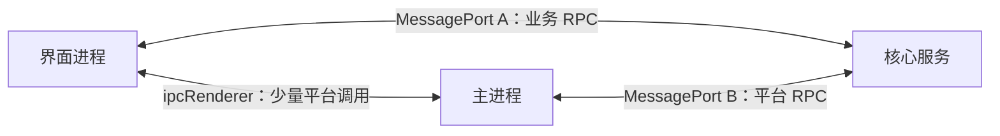
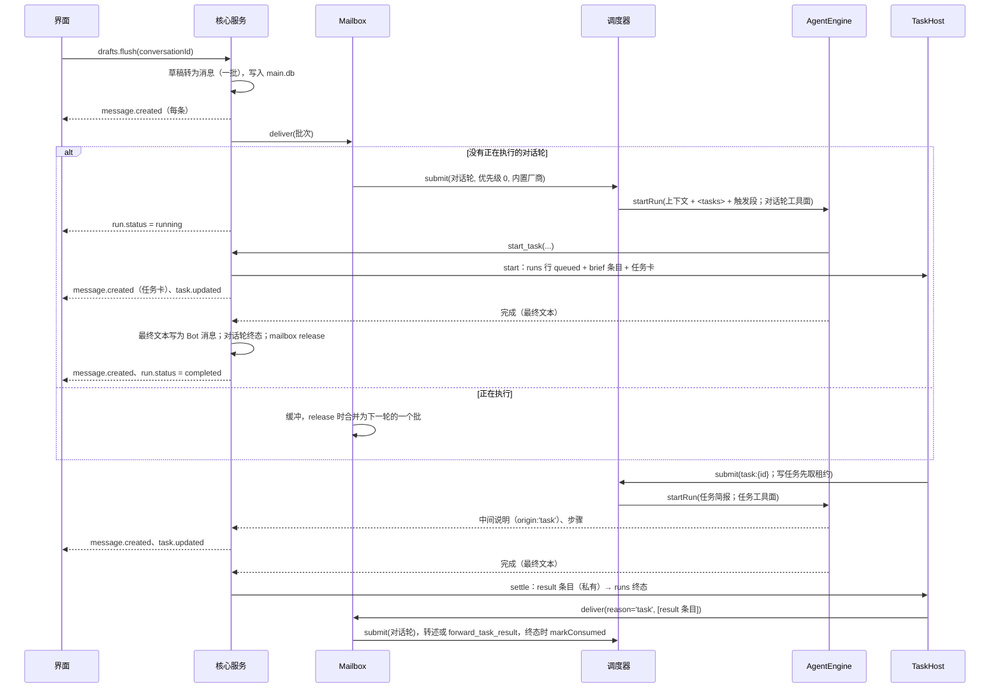
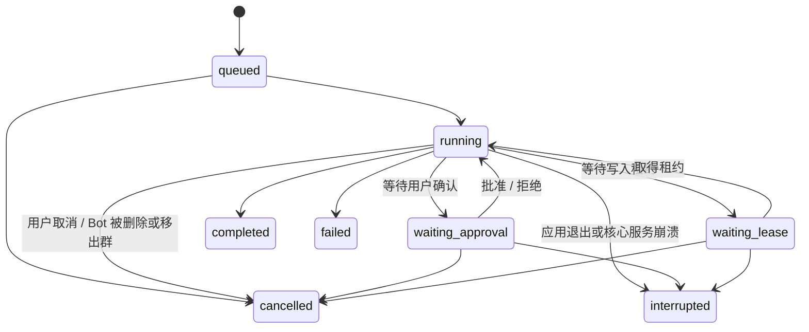

# 02 架构落地

设计依据：[design/06-isolation-and-storage.md](../design/06-isolation-and-storage.md)、[design/07-local-runtime.md](../design/07-local-runtime.md)、[design/09-tech-stack.md](../design/09-tech-stack.md)。

## 进程

| 进程 | 创建方式 | 职责 |
|---|---|---|
| 主进程 | Electron 启动 | 托盘、窗口、看护核心服务、系统对话框（选择目录）、系统通知、电源事件、浏览器页面托管 |
| 界面进程 | 主进程创建的 `BrowserWindow` | Svelte 界面 |
| 核心服务 | 主进程通过 `utilityProcess.fork()` 启动（使用 Electron 内置的 Node） | 全部业务逻辑与数据 |
| 沙箱子进程 | 核心服务按命令启动 | 执行 Bot 的命令 |
| Bot 浏览器页面 | 主进程创建的 `WebContentsView`（每个 Bot 独立会话） | 浏览器工具（P11） |

- 选择 `utilityProcess` 的理由：它是 Electron 官方的 Node 子进程方案，支持 `MessagePort`，随应用退出而退出；原生模块按 Electron ABI 编译即可加载（**需验证**，P00）。
- 窗口关闭时主进程与核心服务都保持运行（托盘）；从托盘退出时三者一起退出。

## 进程间通信



- **端口 A（界面 ↔ 核心服务）**：主进程创建 `MessageChannelMain`，一端交给核心服务，另一端经 preload 交给界面。所有业务调用走这里。
- **端口 B（主进程 ↔ 核心服务）**：核心服务请求平台能力（发送系统通知、控制 Bot 浏览器、更新托盘状态），主进程转发平台事件（电源恢复、窗口焦点变化）。
- **ipcRenderer（界面 ↔ 主进程）**：只用于必须由主进程完成的界面动作：打开系统目录选择框、打开 Bot 浏览器窗口、窗口控制。选择目录的结果（路径）由界面再通过端口 A 交给核心服务。
- preload 使用 `contextBridge` 只暴露：获取端口 A、上述少量 ipc 方法。界面进程开启 `contextIsolation`、`sandbox`，关闭 `nodeIntegration`。

### RPC 约定

- 使用 birpc，在两个端口上各建立一个双向 RPC 实例。
- 契约定义在 `packages/shared/src/rpc/`：
  - `methods.ts`：每个方法一个 zod 输入 schema 与输出 schema。
  - `events.ts`：核心服务推送给界面的事件及其载荷 schema。
- 方法命名 `领域.动作`，例如 `conversations.list`、`drafts.add`、`drafts.flush`、`messages.recall`、`runs.cancel`、`approvals.decide`。
- 核心服务在 RPC 层用 zod 校验所有输入；校验失败返回 `INVALID_INPUT`。
- 事件命名 `领域.事件`，例如 `message.created`、`run.status`、`run.progress`、`approval.created`、`approval.resolved`、`lease.waiting`、`grant.changed`、`task.updated`（D75：任务卡 / 状态行的 `TaskView`）、`draft.changed`、`conversation.updated`、`bot.updated`、`unattended.changed`、`core.status`。D75 的任务 RPC：`tasks.get`、`tasks.active`（对话中未结束任务的视图）、`tasks.answer`（问题卡点选）；取消 / 重试任务沿用 `runs.cancel` / `runs.retry`。
- 界面只通过事件更新状态，不轮询。

## 核心服务模块

模块目录见 [01-conventions.md](01-conventions.md#仓库结构)。核心接口如下（TypeScript 示意，实现时可调整细节，但职责边界不变）。

### 执行身份

每次执行、每次工具调用都携带执行身份，工具网关只信任它，不信任模型传入的任何 id。

```ts
type LoopType =
  | 'turn' | 'task'                       // D75：对话轮（只读）/ 任务（task_writes=false 时只读）
  | 'subagent'                            // D66：任务内 delegate_task 的嵌套子 run
  | 'triage' | 'reflection' | 'memory_consolidation'
  | 'profile_curation' | 'wiki_maintenance' | 'skill_authoring' | 'conversation_summary'
  | 'host';                               // 仅 core：宿主伪身份（回退、系统安装、技能导入审批），不落 runs 行，可写

interface RunIdentity {
  runId: string;
  botId: string | null;          // 画像整理等全局 loop 为 null
  conversationId: string | null; // 后台 loop 为 null
  loopType: LoopType;
  chainId?: string;              // Bot 间 @ 连锁
  chainDepth?: number;
}
```

- shared 的 `loopTypeSchema` 没有 `'host'`（它从不出现在 runs 行与 RPC 里）；`'response'` 已改名 `'turn'`、不保留别名（runs 迁移 0007、main 迁移 0020 改写旧行）。
- 写权限由 `ProjectRuntime.writeDenial(identity)` 统一裁决：`turn` 恒只读；`task` 仅 `task_writes === true` 可写（行缺失或为 null 时 fail closed）；`subagent` 沿 `parentRunId` 继承根 run 的规则；被拒的写返回 `RUN_READ_ONLY`。

### AgentEngine（pi 的封装）

业务代码只依赖这个接口，不直接 import pi。实现位于 `core/src/agent/pi-engine.ts`。

```ts
interface AgentEngine {
  startRun(spec: RunSpec): RunHandle;
  complete(req: CompletionRequest): Promise<CompletionResult>; // 单次调用：群聊判断、结构化提取（外部 Agent：一次性精简会话，P6）
}

interface RunSpec {
  identity: RunIdentity;
  model: ModelRef;                       // "provider/modelId"；外部 Agent 为伪 ref "agent:{id}/{model|default}"
  buildSystemPrompt: () => Promise<string>; // 每次请求前调用，可刷新“我的状态”等
  messages: EngineMessage[];             // 上下文消息 + 触发消息
  tools: ToolDefinition[];
  limits: { maxTurns: number };
  // 取消走 RunHandle.abort()（无 signal 字段）
  // —— D72 外部智能体的可选字段，PiEngine 一律忽略 ——
  workdir?: string;                      // Agent 会话 cwd：绑定的 project，否则 workspace
  promptParts?: { session: string; run: string; conversation: string }; // 会话级 / run 级 / 对话（增量）
  external?: {
    agentId: string;                     // 目录 id
    permission: 'read_only' | 'workspace' | 'ask';
    capabilities: string[];              // 注入的能力包（P1 恒为空）
    sessionKey: string;                  // 会话复用 / 桥 token 键：非任务 run 为 bot:conv:agent；任务为 bot:conv:agent:task:{会话行 id}（D75，DEV-010）
    effort?: string;                     // thought_level config option
    onSession?: (agentSessionId: string) => void; // 落 runs.agent_session_id
    background?: boolean;                // P6 后台精简会话：只读、空私有临时 cwd、不复用、只放行桥工具（llm-router 用）
  };
  onSteerRejected?: (text: string) => void; // 异步 steering 被拒时交还该条注入（D75：任务层把对应 inject 条目记为 queued）
}

interface RunHandle {
  steer(text: string): boolean;          // 下一步注入（D75：只用于任务的 inject）；false = 收不下（任务层把 inject 记为 queued）
  abort(reason: string): void;
  onEvent(listener: (e: EngineEvent) => void): () => void;
  tokensSoFar(): number;                 // 连锁预算与任务的 TASK_TOKEN_BUDGET（外部 Agent：已报用量 + 未报轮数 × AGENT_TURN_BUDGET_TOKENS）
  done: Promise<RunOutcome>;             // { status, finalText, skipReply, usage[], error? }
}
```

与 pi 机制的对应见 [04-agent-runtime.md](04-agent-runtime.md#pi-的封装)。

**第二实现 `ExternalAgentEngine`（D72，P1 最小闭环已实现，开发开关下可用）**：经 ACP 驱动外部智能体（Claude Agent / Codex / OpenCode / DeepSeek Harness / Cursor / Antigravity 等；不支持 ACP 的经进程内垫片），位于 `core/src/agent/external/`：`engine.ts`（run 编排与事件映射）、`host.ts`（每个 Agent 一个子进程 + ACP 连接，懒启动、空闲退出、崩溃时活跃 run 以 failed 结算、环境变量白名单）、`acp/client.ts`（ACP SDK 只在此目录引用；权限请求 P1 默认拒绝、未处理的 Agent→客户端请求立即报错）、`providers/`（`AgentProvider` 接口实现与 `PROVIDERS` 登记表，P1 只有 `generic-acp`）、`catalog.ts`（生效目录 = `AGENT_CATALOG` 按发行门禁过滤 + 选择 / 运行门禁）。选择点：共用执行骨架 `#executeRun` 只对**任务**由 `#engineFor(bot)` 按 `bot.profile.runtime.agent.id` 取引擎（空 = pi）——D75 起 `runtime.agent` 是 Bot 的**任务引擎**，对话轮固定走内置引擎；后台 loop 的 `complete()` / `startRun` 经 `agent/llm-router.ts` 路由（P6：有内置模型 → `PiEngine`；否则 → 外部引擎的一次性 / 后台精简会话，见 04-agent-runtime「P6 落地要点」）。外部引擎的 `RunSpec.tools`（按 Bot 选择的能力包过滤）不直接执行，而是经宿主 MCP 桥（本机 HTTP，会话级 token → 当前 run 的 `RunIdentity`）暴露给智能体（P2；P1 不注入）；`model` 为伪 ref `agent:{id}/{model|default}`，使调度器并发键落到 `agent:{id}`；`runs.engine` 记 `builtin` / `agent:{id}`。`ACP session/update` → `EngineEvent` 与 `PiEngine` 逐字段对齐（`assistant{text,stopReason,errorMessage}`，遇顶层 `tool_call` 以 `toolUse` 切分中间说明；`tool_call` / `tool_result` 以 `toolCallId` 配对）。设计见 [design/28-external-agents-acp.md](../design/28-external-agents-acp.md)，执行方案见 `todo/acp-external-agents.md`。

### 工具

```ts
type ToolAccess = 'none' | 'conversation' | 'fs-read' | 'fs-write' | 'exec' | 'network' | 'host';

interface ToolDefinition<P = unknown> {
  name: string;
  description: string;
  parameters: unknown;                   // pi 要求的 schema 格式
  access: ToolAccess;
  execute(params: P, ctx: ToolContext): Promise<ToolResult>;
}

interface ToolContext {
  identity: RunIdentity;
  signal: AbortSignal;
  gateway: Gateway;
  progress(text: string): void;          // 推送给界面的步骤说明，例如“正在读取 3 个文件”
}

interface ToolResult {
  ok: boolean;
  content: string;                       // 返回给模型的文本（已截断、已脱敏）
  errorCode?: string;
  terminate?: boolean;                   // 例如 skip_reply
}
```

### 工具网关

所有工具的副作用都经过网关。

```ts
interface Gateway {
  checkPath(id: RunIdentity, path: string, mode: 'read' | 'write'): Promise<PathDecision>;
  // PathDecision: { kind: 'allowed' } | { kind: 'needs_grant' } | { kind: 'forbidden', reason }
  ensurePathAccess(id: RunIdentity, path: string, mode: 'read' | 'write', reason: string): Promise<void>;
  // 需要授权时发起审批并挂起，批准后返回，拒绝时抛出 APPROVAL_DENIED
  exec(id: RunIdentity, req: ExecRequest): Promise<ExecResult>;
  // 有沙箱：生成策略并在沙箱中执行；无沙箱：逐条确认模式（白名单除外）
  requestApproval(id: RunIdentity, req: ApprovalRequest): Promise<ApprovalDecision>;
  audit(id: RunIdentity, action: string, detail: Record<string, unknown>): void;
}
```

D75 补充：

- **只读 run 硬拒写**：`writeDenial(identity)` 非空（对话轮、只读任务及其子代理）时，文件写返回 `forbidden` + `readOnlyRun`（工具错误码 `RUN_READ_ONLY`），命令以只读挂载的策略执行，沙箱外执行 / git 远程 / 租约申请一律拒绝；媒体生成、浏览器下载、技能安装、环境申请经 `tools/read-only.ts` `readOnlyRefusal` 同样拒绝（只读 run 的浏览器下载改落应用缓存 `readOnlyDownloadsDir`）。`checkHostCopyPath(identity, path, hostDir)` 让只读 run 的宿主代复制（`get_attachment`）限定在 workspace 的该子目录。
- **「仅这一次」= 单次工具调用**（DEV-009，待确认）：每次工具调用在 `permissions/tool-call-scope.ts` 的 `AsyncLocalStorage` 作用域里执行；once 授权归属于使用它的调用（`GrantsService.noteOnceUse`），调用结束即撤销；`request_access` 走 `ensurePathAccess(…, { preauthorize: true })`，预授权由第一次用到它的调用认领；另有 `GRANT_ABSOLUTE_TTL_MS` 与 run 结束兜底，自动撤销经 `GrantsService.onAutoRevoke` 发布 `grant.changed`。
- **对话轮不等用户**（DEV-014，待确认）：对话轮的越界读取不发起审批，当场返回 `PATH_OUT_OF_SCOPE`。

### 沙箱

```ts
interface SandboxBackend {
  kind: 'srt' | 'wsl' | 'lima' | 'podman';
  probe(): Promise<SandboxAvailability>; // { available, reason?, fixHint? }
  exec(req: SandboxExecRequest): Promise<SandboxExecResult>; // { exitCode, stdout, stderr, violations[] }
}

interface SandboxPolicy {
  readWrite: string[];
  readOnly: string[];
  denyRead: string[];
  denyWrite: string[];
  network: {
    mode: 'none' | 'allowlist' | 'open';
    allowDomains: string[];
    denyDomains: string[];
    allowLocalhost: boolean;
    allowedPorts?: [number, number][];
  };
  env: Record<string, string>;           // 缓存目录、工具链 PATH 等
}
```

策略由 `sandbox/policy.ts` 根据执行身份、workspace、project（及写入租约）、有效授权、Profile 的网络配置生成，每条命令重新生成。

### 调度（`scheduler/scheduler.ts`）

```ts
type Priority = 0 | 1 | 2;
// 0：用户触发的对话轮（任一来源批为 direct / mention / reply / broadcast / delegation / task）、群聊判断、已持租约的写任务
// 1：定时 / 事件 / 连锁触发的对话轮、只读任务；2：后台 loop

interface SchedulerJob {
  priority: Priority;
  provider: string;        // 厂商并发键；外部智能体为 agent:{id}
  key: string;             // 对话轮 = mailbox 键 botId:conversationId；任务 = task:{id}
  runId?: string;          // 该作业执行的 run：它等写租约时让出名额（yieldSlotWhile）
  leaseHeld?: boolean;     // 写任务提交前已取得租约
  run(signal: AbortSignal): Promise<void>;
}
class Scheduler {
  submit(job: SchedulerJob): void;
  cancelQueued(key: string): boolean;                       // 撤出尚未开始的作业（排队中被取消的任务）
  yieldSlotWhile<T>(runId: string, wait: Promise<T>): Promise<T>; // 等租约期间让出名额，取得后优先拿回
  concurrencyFor(provider: string): number;
}
```

- 每个模型厂商有并发上限（默认 4，可在设置中调整）；后台 loop 全局并发上限 `BACKGROUND_LOOP_CONCURRENCY`（2）。同优先级先进先出；运行中的作业不被抢占；某厂商满额时跳过其候选、不阻塞其他厂商的作业。
- **为回复留名额**（内置厂商，上限 N > 1）：只读任务（`task:*`、无 `leaseHeld`）只在占用 < N−1 时启动；已持租约的写任务在占用 < N 且任务合计占用 < N−1 时启动。N = 1 不预留。
- **借用（D75 审查 M3）**：厂商占满且全部被任务占用时，优先级 0 的非任务作业可再启动一个——配置上限 N 在全被任务占用时实际可到 N+1。
- **外部智能体（`agent:{id}`）**：上限 = `agentConcurrency(agentId, 设置)`（`features.parallelSessions` 为假恒为 1，未装解析器也是 1）。任务作业用满上限：不为回复预留、回复也不借用（对话轮从不跑在 `agent:*` 上）；后台作业在上限 > 1 时为非后台工作留一个。若将来对话轮再跑在 Agent 上（设计 30 §8.4 第 1 级），必须恢复回复预留。
- **等租约让出名额**：`SlotYieldingLeaseService`（`scheduler/slot-yielding-lease.ts`，start.ts 装配为租约服务）在申请需要排队时经 `yieldSlotWhile` 等待：作业交回名额（同一作业的并行等待按深度计数，0→1 交回、1→0 拿回），取得租约后进入 `#resuming`，先于排队作业拿回名额。同一 run 对同一键的并行 `ensureWriteLease` 并入进行中的申请。

### Mailbox（每个“Bot + 对话”一个，`scheduler/mailbox.ts`）

```ts
class Mailbox {
  deliver(batch: TriggerBatch): string | null;   // 空闲：建对话轮（返回 run id）；运行中：缓冲，返回 null
  bufferMessageEdit(input): boolean;             // 运行中的对话轮读过的消息被编辑 → 缓冲一条 message_edited 事件
  takeBuffered(current?: TriggerBatch): TriggerBatch[];  // 对话轮开始执行时吸收能与 current 同轮的缓冲批
  release(): string | null;                      // 对话轮终态：能同轮的一组缓冲批合并为一批，启动下一轮（其余留到之后）
  clear(): void;
}
interface TriggerBatch {
  conversationId; botId; messages: Message[];    // 全部触发消息（去重，按 seq）
  reason: TriggerReason;                         // 合并批取第一个面向用户的来源段的 reason
  parts?: TriggerPart[];                         // 合并批的各来源段（各自 reason / extraAttributes，各占一个 <trigger>）
  chain?; retryOf?; afterNote?; extraAttributes?;
}
```

- 同一 mailbox 同一时刻最多一个对话轮；对话轮运行中到达的批**不 steer**，缓冲到下一轮（D2 修订）。`mergeTriggerBatches`：同 reason 与属性的段合并，同一消息只出现一次且取最新快照，`chain` 取层数最深的、`afterNote` 取最后一个。只有 `canShareTurn` 的批才合并 / 吸收（审查批 E）：委派批（任一段 reason 为 `delegation`）独占一轮；绑定到不同连锁的批不同轮。
- 对话轮开始执行（`#executeRun` 先 `await Promise.resolve()` 让同一时刻的投递落进缓冲）时 `#absorbIntoTurn`：`takeBuffered` + 合并 + `refreshTriggerBatch`（重读每条消息，撤回的移除），触发变化时 `runs.setTrigger` 更新行（`trigger_parts_json`；吸收了连锁批时连同 `chain_id` / `chain_depth`）。已被消费的任务结果条目在这里丢弃（重试的对话轮自己的触发除外）；吸收后的触发里带的任务 id 记为「被该对话轮持有」，对账不补投它们，直到 `#releaseTurnMailbox`。
- 对话轮终态时 `#releaseTurnMailbox`：先按 DEV-014 规则 `TaskHost.markConsumed`，再 `release()`，然后通知群轮次与 D71 投递闸门「邮箱空闲」。
- `deliver` 的调用方：用户批（单聊直投、群聊经 `GroupTurnCoordinator`）、事件 / 定时（`deliverEventToBot` / `deliverScheduleToBot`）、D71 代发、任务结算唤醒（`TaskHost` 的 `wake` = 以 `reason:'task'` 投递结果 / 失败条目）、`runs.retry`（按 `trigger_parts_json` 重建）。

### TaskHost（D75 任务层，`core/src/dispatch/tasks.ts`，`orchestrator.tasks`）

任务 = `loop_type='task'` 的 runs 行（[design/30](../design/30-supervisor-and-tasks.md) §3）。宿主负责「任务必有结算」，执行由 orchestrator 的共用执行骨架完成。

```ts
class TaskHost implements TaskToolFacade {           // tools/task-tools.ts 的门面
  // 路由（对话轮的工具；深度 1：任务内调用一律 NOT_SUPPORTED）
  start(identity, { title, instruction, sourceMessageIds, writes, workdir?, continuesTaskId? })
    : { taskId; state: 'running' | 'submitted'; queueReason: string | null; alreadyStarted? };
  inject(identity, { taskId, text, sourceMessageIds? }, { onNotDelivered? }): { delivery: 'delivered' | 'queued' };
  cancel(identity, { taskId, reason }): { taskId; state; message };
  list(identity): TaskSummary[];
  forwardResult(identity, taskId): { messageId };
  // 任务侧（§2.4.6）
  ask(identity, { question, options }, signal): Promise<string>;  // ask_user：question 条目 + 问题卡，阻塞到回答（让出名额，见下）
  answerQuestion(messageId, answer): void;                        // tasks.answer：点选直注任务
  // 宿主 / RPC
  cancelById(taskId, reason): Run | null;            // runs.cancel / 更新闸门
  retry(taskId): Run;                                // runs.retry：失败任务 → 接续它的新任务（同简报）
  view(taskId): TaskView | null; activeViews(conversationId): TaskView[]; publishUpdate(taskId): void;
  settle(taskId, { status, resultText?, error?, setup? }): Run | null;  // 幂等
  markConsumed(taskIds): void;                       // 对话轮终态（§3.2 消费）
  recover(): Run[];                                  // 启动修复，先于整批 interrupted
  resume(): void;                                    // 启动：重排 submitted + 对账补投
  sweep(now?): void;                                 // reaper
  isExecuting(taskId): boolean;                      // 含被 reaper 驱逐、尚未退场的执行（会话继承据此判断）
  abortForConversation(id) / abortForBot(id) / abortForBotInConversation(botId, id);
}
```

- **配额与排队**（`#blockedBy`，FIFO 启动）：全局 `TASK_CONCURRENCY_GLOBAL`、对话级 `TASK_CONCURRENCY_PER_CONVERSATION`（计已启动、含等租约 / 等名额的执行）；同一 `task_workdir` 已有写任务在执行 → 「等写入租约（任务 … 持有）」；`launchSlot`（外部智能体 `agent:{id}` 的并发上限）已满 → 「等智能体并发额度」。每个发起对话轮（`origin_run_id`）最多 `TASK_START_MAX_PER_TURN` 个，超限 `TASK_LIMIT_REACHED`；重试出来的对话轮（`retry_of_run_id` 链）再派同名任务时返回已有任务（`alreadyStarted`）。
- **启动**（orchestrator `#startTask`，`TaskRunControl`）：取简报（缺失 = 派出时崩溃 → `failed`）；写任务先 `projects.ensureWriteLease(identity, workdir 根, { pin: true, signal })`（排队原因「等写入租约」，行仍是 `queued`），再以 `task:{id}` 提交调度器（写任务优先级 0 + `leaseHeld`，只读任务优先级 1；provider 为 Bot 的任务引擎）；排队期间被取消 → `cancelQueued` 并释放租约。执行用 `#executeRun(runId, { kind: 'task', batch, task, brief, control })`：触发段 = `buildTaskBriefSegment`，对话层只取共享行，`continues_task_id` 时 `buildTaskReplaySegment`；引擎 run 启动后 `control.attach(handle)`（之前缓冲的注入此时 steer），结束 `detach` / `finish`。
- **注入**：已 attach → `handle.steer(buildTaskInjection(...))`，失败即 `queued`；启动前 → 并入简报（`TaskBrief.injects`）；已收尾 → `queued`。外部智能体异步拒绝 / 确认经 `control.steerRefused` / `steerConfirmed`（FIFO 按文本匹配），未送达的条目改写为 `queued` 并运行调用方的 `onNotDelivered`（§8.4 降级用它另起任务）。任务正在 `ask_user` 时，注入就是回答（`buildTaskAnswer`：转交文本 + 原消息）。
- **结算次序**：终态条目（`appendTaskEvent`，唯一索引幂等；写失败而对话仍在 → 留在 `#unsettled`，由 sweep 重试，任务保持非终态）→ runs 终态 → `onSettled`（once 授权、挂起审批、未在执行时释放租约）→ 唤醒判定 → `wake(botId, conversationId, entry)`（orchestrator：`mailbox.deliver({ reason: 'task', messages: [entry] })`）或直接 `markConsumed`。宿主主动停下的任务当场结算，其执行在 `finish()` 前仍占名额与写入目标。
- **sweep**（start.ts 每 `TASK_SETTLE_SWEEP_MS`）：重试 `#unsettled`；驱逐结算后超过 `TASK_SETTLE_SWEEP_MS` 仍未退场的执行（`releaseExecution`）；超过 `TASK_QUESTION_TTL_MS` 的未答问题按「用户未回答」解除；`TASK_MAX_WALL_MS`（扣除等问题回答的时间）/ `TASK_TOKEN_BUDGET` 超限强制 `failed`；`#pump`；对账（未消费终态任务重投，已投递未消费超过 `TASK_REDELIVER_AFTER_MS` 才重投；被进行中的对话轮持有的不投；每次投递在终态条目的 `deliveries` 上计数，达到 `TASK_REDELIVER_MAX_ATTEMPTS` 标记消费并发可见的 `task_result_undelivered` 提示）；`onSweep`（orchestrator 关闭超过 `CONTINUATION_WINDOW_MS` 的任务外部智能体会话）。
- **界面**：`start` / `retry` 写一张共享任务卡（`kind='card'`，`cardType='task'`，`TASK_CARD`）；`ask` 先写 `question` 条目再推送问题卡（`system_event`，`TASK_QUESTION_EVENT='task_question'`，`taskBotId` = 提问的 Bot；条目写失败则卡片作废），等待期间经 `yieldSlotWhile`（`Scheduler.yieldSlotWhile`，按任务 run id）让出 provider 名额、写租约保留；每次可见变化（`run.status`、注入、注入降级、排队原因变化、回答）推送 `task.updated`（`TaskView`）。
- 启动恢复（§7.4）：`recover()` → `markAllActiveInterrupted({ exceptLoopTypes: ['task'] })` 与审批取消、委派恢复 → `resume()`（orchestrator `recoverInterrupted`）。

### 分发器

负责把用户发出的一批消息分配给目标 Bot，详见 [phases/P05-group-chat.md](phases/P05-group-chat.md)。单聊时目标固定为对话中的 Bot。

### 后台任务队列

反思、记忆整理、画像整理、Wiki 维护、技能生成、对话摘要、定时触发都通过持久化的任务表（`jobs`，见 [03-data-model.md](03-data-model.md#maindb)）驱动。应用退出后任务不丢失，重启后继续。

## 一条消息的完整链路（单聊）



## 执行（Run）状态机



- 等待状态下不消耗 token。
- 核心服务启动时，先修复任务（`TaskHost.recover()`：已有终态条目的补成对应终态，已有取消条目的补成 `cancelled`，已启动无条目的先写 `failure` 条目再标 `interrupted`，submitted 的保留待重排），再把其余 `running`、`waiting_*`、`queued` 状态的执行改为 `interrupted`，对应的待确认审批改为 `cancelled`，并在对应对话中插入系统消息“上次执行因应用退出而中断”；最后重排 submitted 任务并补投未消费的任务结果（被中断的任务因此唤醒一个对话轮）。**不自动恢复执行**。
- 任务的 submitted 用 `queued` 表示；任务在 `running` 下可带 `awaiting_input`（等问题卡回答）。
- 进入 `cancelled`、`failed`、`interrupted` 时释放写入租约、取消该执行的待确认审批（非阻塞提交、需比 run 活得久的审批卡除外，如对话轮的 `profile_change`）；once 授权随之失效。

## 启动、退出与崩溃恢复

启动顺序：

1. 主进程启动，创建托盘，`utilityProcess.fork()` 启动核心服务。
2. 核心服务：解析数据目录 → 初始化日志 → 从钥匙串取主密钥 → 打开并迁移数据库 → 处理中断的执行 → 初始化各服务 → 连接端口 B → 发出 `core.status = ready`。
3. 主进程收到 ready 后创建窗口，建立端口 A 并交给界面与核心服务。

退出：托盘“退出” → 主进程请求核心服务 `system.shutdown` → 核心服务中止所有执行（标记为 `interrupted`）、关闭数据库 → 5 秒内退出，超时强制结束。

崩溃恢复：

- 核心服务意外退出时，主进程按 1s、2s、5s 退避重启；1 分钟内连续失败 5 次，停止重启并在窗口中显示错误与日志位置。
- 界面检测到端口断开时显示“正在重新连接”横幅，主进程重新建立端口 A 后自动恢复。

主密钥异常：

- 钥匙串中取不到主密钥、但数据目录中已有数据库时，**不得生成新密钥覆盖**。核心服务进入 `locked` 状态，界面提示原因（钥匙串不可用 / 密钥丢失），提供“输入口令”（口令模式）或“查看帮助”。

## 数据目录

- 默认 `~/.kepcup/`，环境变量 `KEPCUP_HOME` 可覆盖（测试与开发使用）。
- 目录结构见 [design/11-storage.md](../design/11-storage.md#数据目录)。
- 所有路径由 `infra/paths.ts` 统一生成，其他模块不得自行拼接数据目录下的路径。
