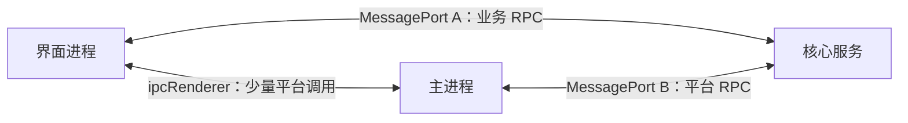
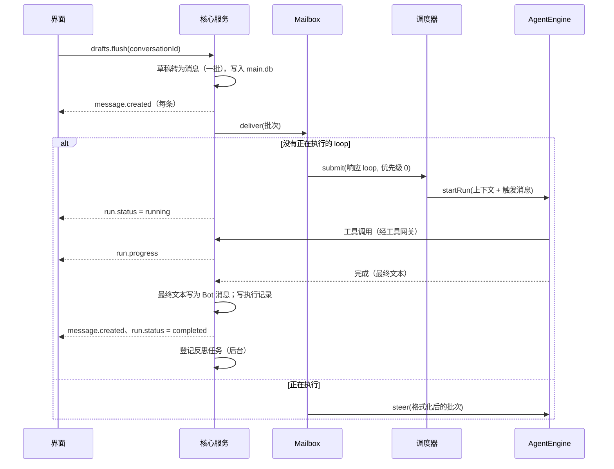
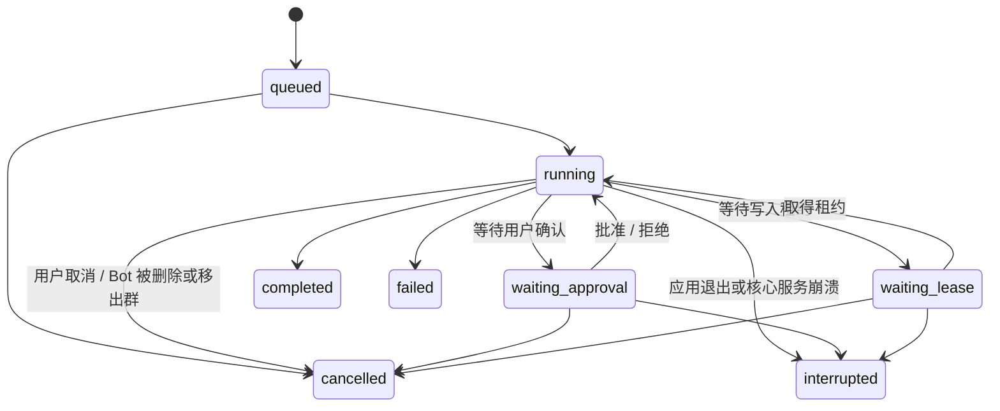

# 02 架构落地

设计依据：[design/06-isolation-and-storage.md](../design/06-isolation-and-storage.md)、[design/07-local-runtime.md](../design/07-local-runtime.md)、[design/09-tech-stack.md](../design/09-tech-stack.md)。

## 进程

| 进程 | 创建方式 | 职责 |
|---|---|---|
| 主进程 | Electron 启动 | 托盘、窗口、看护核心服务、系统对话框（选择目录）、系统通知、电源事件、浏览器页面托管 |
| 界面进程 | 主进程创建的 `BrowserWindow` | Svelte 界面 |
| 核心服务 | 主进程通过 `utilityProcess.fork()` 启动（使用 Electron 内置的 Node） | 全部业务逻辑与数据 |
| 沙箱子进程 | 核心服务按命令启动 | 执行 Bot 的命令 |
| Bot 浏览器页面 | 主进程创建的 `WebContentsView`（每个 Bot 独立会话） | 浏览器工具（P11） |

- 选择 `utilityProcess` 的理由：它是 Electron 官方的 Node 子进程方案，支持 `MessagePort`，随应用退出而退出；原生模块按 Electron ABI 编译即可加载（**需验证**，P00）。
- 窗口关闭时主进程与核心服务都保持运行（托盘）；从托盘退出时三者一起退出。

## 进程间通信



- **端口 A（界面 ↔ 核心服务）**：主进程创建 `MessageChannelMain`，一端交给核心服务，另一端经 preload 交给界面。所有业务调用走这里。
- **端口 B（主进程 ↔ 核心服务）**：核心服务请求平台能力（发送系统通知、控制 Bot 浏览器、更新托盘状态），主进程转发平台事件（电源恢复、窗口焦点变化）。
- **ipcRenderer（界面 ↔ 主进程）**：只用于必须由主进程完成的界面动作：打开系统目录选择框、打开 Bot 浏览器窗口、窗口控制。选择目录的结果（路径）由界面再通过端口 A 交给核心服务。
- preload 使用 `contextBridge` 只暴露：获取端口 A、上述少量 ipc 方法。界面进程开启 `contextIsolation`、`sandbox`，关闭 `nodeIntegration`。

### RPC 约定

- 使用 birpc，在两个端口上各建立一个双向 RPC 实例。
- 契约定义在 `packages/shared/src/rpc/`：
  - `methods.ts`：每个方法一个 zod 输入 schema 与输出 schema。
  - `events.ts`：核心服务推送给界面的事件及其载荷 schema。
- 方法命名 `领域.动作`，例如 `conversations.list`、`drafts.add`、`drafts.flush`、`messages.recall`、`runs.cancel`、`approvals.decide`。
- 核心服务在 RPC 层用 zod 校验所有输入；校验失败返回 `INVALID_INPUT`。
- 事件命名 `领域.事件`，例如 `message.created`、`run.status`、`run.progress`、`approval.created`、`approval.resolved`、`lease.waiting`、`draft.changed`、`conversation.updated`、`bot.updated`、`unattended.changed`、`core.status`。
- 界面只通过事件更新状态，不轮询。

## 核心服务模块

模块目录见 [01-conventions.md](01-conventions.md#仓库结构)。核心接口如下（TypeScript 示意，实现时可调整细节，但职责边界不变）。

### 执行身份

每次执行、每次工具调用都携带执行身份，工具网关只信任它，不信任模型传入的任何 id。

```ts
type LoopType =
  | 'response' | 'triage' | 'reflection' | 'memory_consolidation'
  | 'profile_curation' | 'wiki_maintenance' | 'skill_authoring' | 'conversation_summary';

interface RunIdentity {
  runId: string;
  botId: string | null;          // 画像整理等全局 loop 为 null
  conversationId: string | null; // 后台 loop 为 null
  loopType: LoopType;
  chainId?: string;              // Bot 间 @ 连锁
  chainDepth?: number;
}
```

### AgentEngine（pi 的封装）

业务代码只依赖这个接口，不直接 import pi。实现位于 `core/src/agent/pi-engine.ts`。

```ts
interface AgentEngine {
  startRun(spec: RunSpec): RunHandle;
  complete(req: CompletionRequest): Promise<CompletionResult>; // 单次调用：群聊判断、结构化提取（外部 Agent：一次性精简会话，P6）
}

interface RunSpec {
  identity: RunIdentity;
  model: ModelRef;                       // "provider/modelId"；外部 Agent 为伪 ref "agent:{id}/{model|default}"
  buildSystemPrompt: () => Promise<string>; // 每次请求前调用，可刷新“我的状态”等
  messages: EngineMessage[];             // 上下文消息 + 触发消息
  tools: ToolDefinition[];
  limits: { maxTurns: number };
  // 取消走 RunHandle.abort()（无 signal 字段）
  // —— D72 外部智能体的可选字段，PiEngine 一律忽略 ——
  workdir?: string;                      // Agent 会话 cwd：绑定的 project，否则 workspace
  promptParts?: { session: string; run: string; conversation: string }; // 会话级 / run 级 / 对话（增量）
  external?: {
    agentId: string;                     // 目录 id
    permission: 'read_only' | 'workspace' | 'ask';
    capabilities: string[];              // 注入的能力包（P1 恒为空）
    sessionKey: string;                  // (Bot, 对话, Agent) 会话复用键
    effort?: string;                     // thought_level config option
    onSession?: (agentSessionId: string) => void; // 落 runs.agent_session_id
    background?: boolean;                // P6 后台精简会话：只读、空私有临时 cwd、不复用、只放行桥工具（llm-router 用）
  };
  onSteerRejected?: (text: string) => void; // 异步 steering 被拒时交还 pending steer（P5）
}

interface RunHandle {
  steer(text: string): boolean;          // 下一步注入；false = loop 已结束（orchestrator 改为缓冲续投）
  abort(reason: string): void;
  onEvent(listener: (e: EngineEvent) => void): () => void;
  tokensSoFar(): number;                 // 连锁预算（外部 Agent 恒为 0）
  done: Promise<RunOutcome>;             // { status, finalText, skipReply, usage[], error? }
}
```

与 pi 机制的对应见 [04-agent-runtime.md](04-agent-runtime.md#pi-的封装)。

**第二实现 `ExternalAgentEngine`（D72，P1 最小闭环已实现，开发开关下可用）**：经 ACP 驱动外部智能体（Claude Agent / Codex / OpenCode / DeepSeek Harness / Cursor / Antigravity 等；不支持 ACP 的经进程内垫片），位于 `core/src/agent/external/`：`engine.ts`（run 编排与事件映射）、`host.ts`（每个 Agent 一个子进程 + ACP 连接，懒启动、空闲退出、崩溃时活跃 run 以 failed 结算、环境变量白名单）、`acp/client.ts`（ACP SDK 只在此目录引用；权限请求 P1 默认拒绝、未处理的 Agent→客户端请求立即报错）、`providers/`（`AgentProvider` 接口实现与 `PROVIDERS` 登记表，P1 只有 `generic-acp`）、`catalog.ts`（生效目录 = `AGENT_CATALOG` 按发行门禁过滤 + 选择 / 运行门禁）。选择点：`#executeResponseRun` 由 `#engineFor(bot)` 按 `bot.profile.runtime.agent.id` 取引擎（空 = pi）；后台 loop 的 `complete()` / `startRun` 经 `agent/llm-router.ts` 路由（P6：有内置模型 → `PiEngine`；否则 → 外部引擎的一次性 / 后台精简会话，见 04-agent-runtime「P6 落地要点」）。外部引擎的 `RunSpec.tools`（按 Bot 选择的能力包过滤）不直接执行，而是经宿主 MCP 桥（本机 HTTP，会话级 token → 当前 run 的 `RunIdentity`）暴露给智能体（P2；P1 不注入）；`model` 为伪 ref `agent:{id}/{model|default}`，使调度器并发键落到 `agent:{id}`；`runs.engine` 记 `builtin` / `agent:{id}`。`ACP session/update` → `EngineEvent` 与 `PiEngine` 逐字段对齐（`assistant{text,stopReason,errorMessage}`，遇顶层 `tool_call` 以 `toolUse` 切分中间说明；`tool_call` / `tool_result` 以 `toolCallId` 配对）。设计见 [design/28-external-agents-acp.md](../design/28-external-agents-acp.md)，执行方案见 `todo/acp-external-agents.md`。

### 工具

```ts
type ToolAccess = 'none' | 'conversation' | 'fs-read' | 'fs-write' | 'exec' | 'network' | 'host';

interface ToolDefinition<P = unknown> {
  name: string;
  description: string;
  parameters: unknown;                   // pi 要求的 schema 格式
  access: ToolAccess;
  execute(params: P, ctx: ToolContext): Promise<ToolResult>;
}

interface ToolContext {
  identity: RunIdentity;
  signal: AbortSignal;
  gateway: Gateway;
  progress(text: string): void;          // 推送给界面的步骤说明，例如“正在读取 3 个文件”
}

interface ToolResult {
  ok: boolean;
  content: string;                       // 返回给模型的文本（已截断、已脱敏）
  errorCode?: string;
  terminate?: boolean;                   // 例如 skip_reply
}
```

### 工具网关

所有工具的副作用都经过网关。

```ts
interface Gateway {
  checkPath(id: RunIdentity, path: string, mode: 'read' | 'write'): Promise<PathDecision>;
  // PathDecision: { kind: 'allowed' } | { kind: 'needs_grant' } | { kind: 'forbidden', reason }
  ensurePathAccess(id: RunIdentity, path: string, mode: 'read' | 'write', reason: string): Promise<void>;
  // 需要授权时发起审批并挂起，批准后返回，拒绝时抛出 APPROVAL_DENIED
  exec(id: RunIdentity, req: ExecRequest): Promise<ExecResult>;
  // 有沙箱：生成策略并在沙箱中执行；无沙箱：逐条确认模式（白名单除外）
  requestApproval(id: RunIdentity, req: ApprovalRequest): Promise<ApprovalDecision>;
  audit(id: RunIdentity, action: string, detail: Record<string, unknown>): void;
}
```

### 沙箱

```ts
interface SandboxBackend {
  kind: 'srt' | 'wsl' | 'lima' | 'podman';
  probe(): Promise<SandboxAvailability>; // { available, reason?, fixHint? }
  exec(req: SandboxExecRequest): Promise<SandboxExecResult>; // { exitCode, stdout, stderr, violations[] }
}

interface SandboxPolicy {
  readWrite: string[];
  readOnly: string[];
  denyRead: string[];
  denyWrite: string[];
  network: {
    mode: 'none' | 'allowlist' | 'open';
    allowDomains: string[];
    denyDomains: string[];
    allowLocalhost: boolean;
    allowedPorts?: [number, number][];
  };
  env: Record<string, string>;           // 缓存目录、工具链 PATH 等
}
```

策略由 `sandbox/policy.ts` 根据执行身份、workspace、project（及写入租约）、有效授权、Profile 的网络配置生成，每条命令重新生成。

### 调度

```ts
type Priority = 0 | 1 | 2;
// 0：用户触发的响应与群聊判断；1：定时与事件触发的响应；2：后台 loop

interface Scheduler {
  submit(job: { priority: Priority; provider: string; key: string; run: () => Promise<void> }): void;
}
```

- 每个模型厂商有并发上限（默认 4，可在设置中调整）；后台 loop 全局并发上限 2。
- 同优先级先进先出；高优先级任务不打断正在执行的低优先级任务。

### Mailbox（每个“Bot + 对话”一个）

```ts
interface Mailbox {
  deliver(batch: TriggerBatch): void;    // 一批消息或一个事件
}
```

- 没有正在执行的响应 loop：创建执行（Run），提交给调度器。
- 有正在执行的响应 loop：把批次格式化为注入消息，调用 `steer()`。
- 同一 mailbox 同一时刻最多一个响应 loop。

### TaskHost（D75 任务层，W1-A 落地；实现 `core/src/dispatch/tasks.ts`）

任务 = `loop_type='task'` 的 runs 行（[design/30](../design/30-supervisor-and-tasks.md) §3）。宿主负责「任务必有结算」，执行由 orchestrator 的共用执行骨架（`#executeRun`，`kind:'task'`）完成。

```ts
class TaskHost implements TaskToolFacade {           // tools/task-tools.ts 的门面
  start(identity, { title, instruction, sourceMessageIds, writes, workdir?, continuesTaskId? })
    : { taskId; state: 'running' | 'submitted'; queueReason: string | null };
  inject(identity, { taskId, text, sourceMessageIds? }): { delivery: 'delivered' | 'queued' };
  cancel(identity, { taskId, reason }): { taskId; state; message };
  list(identity): TaskSummary[];
  forwardResult(identity, taskId): { messageId };
  cancelById(taskId, reason): Run | null;            // runs.cancel RPC / 更新闸门
  recordQuestion(taskId, { text, questionMessageId }): void;   // §2.4.6
  settle(taskId, { status, resultText?, error?, setup? }): Run | null;  // 幂等
  markConsumed(taskIds): void;                       // 对话层终态时调用（§3.2 消费）
  recover(): Run[];                                  // 启动修复，先于整批 interrupted
  resume(): void;                                    // 启动：重排 submitted + 对账补投
  sweep(now?): void;                                 // reaper：时限 / token 预算 + 对账
  abortForConversation(id) / abortForBot(id) / abortForBotInConversation(botId, id);
}
```

- `start`：先写 `queued`（= submitted）行，再写私有 `brief` 条目，再按配额启动（对话级 / 全局并发、同一 workdir 一个写任务；每个发起轮按 `origin_run_id` 计数，超限报 `TASK_LIMIT_REACHED`）；任务内调用一律拒绝（深度 1）。
- 结算次序：终态条目（`appendTaskEvent` 幂等）→ runs 终态 → 唤醒判定（§3.3）→ 注入的 `wake(botId, conversationId, entry)`。本波默认 `wake` = 把条目作为 `TriggerBatch{reason:'task'}` 交给 mailbox；响应 run 终态时对其触发批 / 已注入批中的任务条目 `markConsumed`（W2 改挂对话轮终态）。
- 宿主停下的任务（取消 / reaper / 删除）当场结算，但其执行在退场（`TaskRunControl.finish()`）前仍占并发名额与写入目标、自己释放租约；退场不回来的执行由 reaper 在 `TASK_SETTLE_SWEEP_MS` 后驱逐。已投递待消费的结果超过 `TASK_REDELIVER_AFTER_MS` 未消费时 reaper 重投。
- 执行骨架（`RunExecution = {kind:'response', batch} | {kind:'task', batch, task, brief, control}`）：`#startTask` 先取简报、写任务先 `projects.ensureWriteLease(identity, workdir 根, { pin: true, signal })`（整任务持有；等待期间行仍是 `queued`，不占调度名额），再以调度键 `task:{id}`、优先级 1 提交（调度器对 `task:` 作业总给对话回复留一个厂商名额）；`loop_type='task'`；触发段 = `buildTaskBriefSegment`（交代 + 原消息原文，图片照触发批进视觉通道）；对话层只取共享行；中间说明带 `origin:'task'`；最终文本 → `result` 条目，`skip_reply` → 空结果；失败 / 取消 / 中断 → `failure` 条目（尾部 `buildRunDigest`）。
- 启动恢复（§7.4）：`recover()` → `markAllActiveInterrupted({ exceptLoopTypes: ['task'] })` 等 → `resume()`；`sweep()` 每 `TASK_SETTLE_SWEEP_MS` 一次（start.ts）。

### 分发器

负责把用户发出的一批消息分配给目标 Bot，详见 [phases/P05-group-chat.md](phases/P05-group-chat.md)。单聊时目标固定为对话中的 Bot。

### 后台任务队列

反思、记忆整理、画像整理、Wiki 维护、技能生成、对话摘要、定时触发都通过持久化的任务表（`jobs`，见 [03-data-model.md](03-data-model.md#maindb)）驱动。应用退出后任务不丢失，重启后继续。

## 一条消息的完整链路（单聊）



## 执行（Run）状态机



- 等待状态下不消耗 token。
- 核心服务启动时，把所有 `running`、`waiting_*`、`queued` 状态的执行改为 `interrupted`，对应的待确认审批改为 `cancelled`，并在对应对话中插入系统消息“上次执行因应用退出而中断”。**不自动恢复执行**。
- 进入 `cancelled`、`failed`、`interrupted` 时释放写入租约、取消该执行的待确认审批。

## 启动、退出与崩溃恢复

启动顺序：

1. 主进程启动，创建托盘，`utilityProcess.fork()` 启动核心服务。
2. 核心服务：解析数据目录 → 初始化日志 → 从钥匙串取主密钥 → 打开并迁移数据库 → 处理中断的执行 → 初始化各服务 → 连接端口 B → 发出 `core.status = ready`。
3. 主进程收到 ready 后创建窗口，建立端口 A 并交给界面与核心服务。

退出：托盘“退出” → 主进程请求核心服务 `system.shutdown` → 核心服务中止所有执行（标记为 `interrupted`）、关闭数据库 → 5 秒内退出，超时强制结束。

崩溃恢复：

- 核心服务意外退出时，主进程按 1s、2s、5s 退避重启；1 分钟内连续失败 5 次，停止重启并在窗口中显示错误与日志位置。
- 界面检测到端口断开时显示“正在重新连接”横幅，主进程重新建立端口 A 后自动恢复。

主密钥异常：

- 钥匙串中取不到主密钥、但数据目录中已有数据库时，**不得生成新密钥覆盖**。核心服务进入 `locked` 状态，界面提示原因（钥匙串不可用 / 密钥丢失），提供“输入口令”（口令模式）或“查看帮助”。

## 数据目录

- 默认 `~/.kepcup/`，环境变量 `KEPCUP_HOME` 可覆盖（测试与开发使用）。
- 目录结构见 [design/11-storage.md](../design/11-storage.md#数据目录)。
- 所有路径由 `infra/paths.ts` 统一生成，其他模块不得自行拼接数据目录下的路径。
